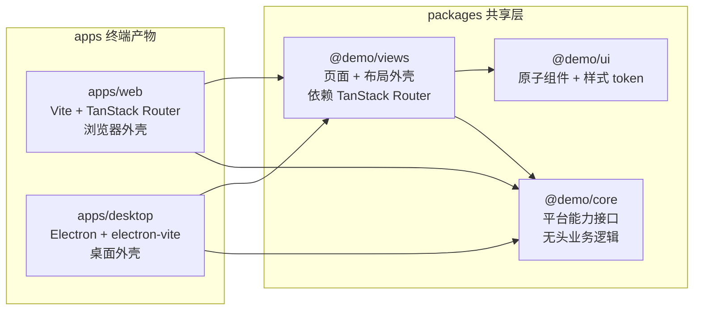
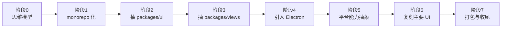

# 00 · 学习计划（总纲）

> 本文是整个学习系列的总纲。读完它，你应当能回答三个问题：**最终要做出什么**、**分几步做**、**每一步的「完成」长什么样**。

---

## 1. 起点、终点、差距

**起点（你已经有的）**

- `apps/web`：一个用 TanStack Router（file-router 模式）初始化好的 Vite + React 19 + Tailwind v4 单页应用。
- 仓库还不是真正的 monorepo：只有 `apps/web`，没有根 `package.json`、没有 `pnpm-workspace.yaml`、没有 `packages/`。
- 你懂 Next.js / TS / React，但不熟 Electron，尤其不熟「web 与 desktop 怎么共用代码」。

**终点（要达到的）**

- 一个 pnpm workspace monorepo，包含：
  - `apps/web` —— 浏览器外壳（Vite + TanStack Router）
  - `apps/desktop` —— Electron 桌面外壳（electron-vite）
  - `packages/ui` —— 原子组件 + 样式 token
  - `packages/views` —— 共享页面 + 布局外壳（侧边栏、顶栏）
  - `packages/core` —— 无头业务逻辑 / 平台能力抽象（精简版）
- 一套 multica 风格的主要 UI（工作区切换、侧边导航、顶栏、几个功能页、明暗主题），在 web 和 desktop 里**长得一样、行为一致**。
- `pnpm dev` 同时起两端；改一个共享组件，两端热更新。

**差距（要补的能力）**

1. 把单 app 改造成 monorepo。
2. 学会「共享包」的拆分边界（什么放 `ui`、什么放 `views`、什么放 `core`）。
3. 学会 Electron 的三进程模型（main / preload / renderer）与 IPC。
4. 学会用一个**平台能力抽象层**抹平 web/desktop 差异。
5. 学会 electron-vite 的开发（连 dev server）与生产（loadFile）两种加载方式。

---

## 2. 核心学习目标

按优先级排列，这五条是整个项目的「成功标准」：

1. **复用机制**：能讲清楚「为什么 `packages/views` 里写的页面能同时被 web 和 desktop 使用」，并能自己新增一个共享页面。
2. **Electron 基本盘**：能讲清楚 main / preload / renderer 三个进程各自的职责、为什么 preload 是唯一桥梁、dev 与 prod 加载方式的区别。
3. **平台抽象**：能识别「这段代码在 web 和 desktop 行为不同」的场景，并用一个接口 + 两个实现的方式隔离差异（而不是满地 `if (isDesktop)`）。
4. **monorepo 工程化**：会用 pnpm workspace + turbo 组织多包，理解 `workspace:*`、版本统一、`dedupe` 解决「两个 React 实例」问题。
5. **UI 复刻**：做出 multica 风格的 dashboard 外壳，理解它的布局与导航设计。

---

## 3. 目标架构

下图是完成态。两个 app（左）是薄外壳，共享逻辑放在右边的三个包里。**依赖方向单向**：`views → ui + core`，`core` 与 `ui` 互相独立。

> 对照 multica：它把同一套页面放在 `packages/views`，web（Next.js）和 desktop（react-router）各自实现一个 `NavigationAdapter` 接口来对接共享页面。你的栈比它简单——见 `01` 的解释。

---

## 4. 八阶段学习路径

每个阶段都是**一个独立可验证的里程碑**。做完一阶段，代码能跑、你能讲清原理，再进下一阶段。

下表是总览，详细内容在每个阶段的独立文档里。

| 阶段 | 主题 | 核心学到 | 完成标志 |
|---|---|---|---|
| **0** | 架构与思维模型 | web→desktop 认知迁移、三进程模型、复用原理 | 能口述依赖方向与抽象必要性（本文档 `01`） |
| **1** | monorepo 化 | pnpm-workspace、turbo、根 package.json | `pnpm -C apps/web dev` 仍正常起 |
| **2** | 抽 `packages/ui` | 共享包、`workspace:*`、`cn()` 工具、Button | web 里 `import { Button } from '@demo/ui'` 可用 |
| **3** | 抽 `packages/views` | 共享页面/布局、provider 套法、文件源码导出 | web 渲染来自 `@demo/views` 的 DashboardLayout |
| **4** | 引入 Electron | electron-vite、main/preload/renderer、dev vs prod 加载 | `pnpm dev:desktop` 弹出窗口显示同一套 UI |
| **5** | 平台能力抽象 | 接口 + 双实现、`window.desktopAPI`、平台探测 | 「打开外链」在 web 走浏览器、在 desktop 走系统 |
| **6** | 复刻主要 UI | 侧边栏、顶栏、工作区切换、明暗主题、若干页面 | 两端都呈现 multica 风格的 dashboard |
| **7** | 打包与收尾 | electron-builder、脚本编排、typecheck/test | 能产出可安装包，全流程跑通 |

---

## 5. 各阶段详解

下面把每个阶段要做什么、产出哪些文件、怎么验证，逐条写清楚。这是「执行清单」。

### 阶段 1 · monorepo 化（对应 `02-monorepo-化.md`）

- **目标**：把仓库变成 pnpm workspace，但不破坏现有 `apps/web`。
- **关键概念**：`pnpm-workspace.yaml` 的 `packages` 字段、根 `package.json` 的脚本委托、turbo 的任务编排（`turbo.json` 里 `dev` 的 `persistent: true`）。
- **产出文件**：
  - 根 `package.json`（含 `dev:web` / `dev:desktop` 脚本，委托给 turbo）
  - `pnpm-workspace.yaml`
  - `turbo.json`
- **验证**：`pnpm install` 成功；`pnpm dev:web` 起得来，页面与改造前一致。

### 阶段 2 · 抽取 `packages/ui`（对应 `03-抽取-packages-ui.md`）

- **目标**：建第一个共享包，掌握「原始 `.ts/.tsx` 源码导出 + 各 app 各自编译」这套机制。
- **关键概念**：`exports` 字段映射、`workspace:*`、Tailwind v4 的 `@source` 与共享样式、版本统一（catalog 或手动对齐）。
- **产出文件**：
  - `packages/ui/package.json`、`tsconfig.json`
  - `packages/ui/lib/utils.ts`（`cn()`）
  - `packages/ui/components/ui/button.tsx`
  - `packages/ui/styles/tokens.css`（设计 token）
- **验证**：在 `apps/web` 里用 `<Button>`，样式正确；改 Button 源码，web 热更新。

### 阶段 3 · 抽取 `packages/views`（对应 `04-抽取-packages-views.md`）

- **目标**：把页面与布局外壳抽出来，这是 web/desktop 复用的**核心**。
- **关键概念**：共享组件如何用 TanStack Router（因为两端同构，可**直接**用，不必像 multica 那样套 `NavigationAdapter`）；Provider 栈组织；`packages/views` 依赖 `ui` + `core`。
- **产出文件**：
  - `packages/views/package.json`、`tsconfig.json`
  - `packages/views/layout/dashboard-layout.tsx`（外壳：侧边栏 + 顶栏 + 内容区）
  - `packages/views/pages/home.tsx`（一个共享页）
  - `packages/views/index.ts`（统一出口）
- **验证**：`apps/web` 的路由里渲染来自 `@demo/views` 的 `DashboardLayout`，导航在 web 里正常跳转。

### 阶段 4 · 引入 Electron（对应 `05-引入-electron.md`）

- **目标**：搭起 `apps/desktop`，让一个 Electron 窗口显示**和 web 一模一样**的 UI。
- **关键概念**：electron-vite 的 `main` / `preload` / `renderer` 三段配置；`BrowserWindow` 创建；`webPreferences.preload` 与 contextIsolation；**dev 连 Vite server、prod loadFile** 这条经典分支（对照 multica `apps/desktop/src/main/index.ts:310`）；`dedupe` 防「两个 React」。
- **产出文件**：
  - `apps/desktop/package.json`、`electron.vite.config.ts`、`tsconfig.node.json`、`tsconfig.web.json`
  - `apps/desktop/src/main/index.ts`（最小主进程）
  - `apps/desktop/src/preload/index.ts`（最小 preload，先暴露一个 `appInfo`）
  - `apps/desktop/src/renderer/`（入口 `main.tsx` + `index.html` + 复用 `@demo/views`）
- **验证**：`pnpm dev:desktop` 弹出窗口，显示 `DashboardLayout`；与 `pnpm dev:web` 视觉一致。

### 阶段 5 · 平台能力抽象（对应 `06-平台能力抽象.md`）

- **目标**：处理 web/desktop 行为差异，建立「接口 + 双实现」模式。
- **关键概念**：平台探测（`typeof window !== 'undefined' && window.desktopAPI`）、能力接口定义放在 `@demo/core`、各 app 在 Provider 里注入实现；预加载脚本用 `contextBridge.exposeInMainWorld` 安全暴露能力；IPC 的 `handle`/`on` 两种注册。
- **典型场景**：打开外链（web: `window.open`；desktop: `shell.openExternal`）、原生通知、复制到剪贴板。
- **产出文件**：
  - `packages/core/platform/types.ts`（能力接口）
  - `packages/core/platform/context.tsx`（Provider + hook）
  - `apps/web` 的实现注入
  - `apps/desktop` 的实现注入 + preload 扩展 + main 进程 IPC
- **验证**：点一个「打开文档」按钮，web 在新标签打开、desktop 在系统浏览器打开。

### 阶段 6 · 复刻主要 UI（对应 `07-复刻主要-ui.md`）

- **目标**：做出 multica 风格的 dashboard 外壳与若干页面，两端一致。
- **关键概念**：shadcn 风格组件在 `@demo/ui` 里的落地、Sidebar/Topbar/ThemeToggle 的拆分、TanStack Router 的嵌套路由（`__root` + 子路由）、明暗主题（CSS 变量 + `class` 切换）。
- **产出文件**：扩展 `@demo/ui`（sidebar、dropdown、tooltip 等）、扩展 `@demo/views`（app-sidebar、topbar、home/issues/settings 页面）、两端路由接线。
- **验证**：侧边栏导航可切换页面；主题切换生效；两端一致；响应式基本可用。

### 阶段 7 · 打包与收尾（对应 `08-打包与收尾.md`）

- **目标**：能把 desktop 打成可安装包，并梳理工程化。
- **关键概念**：`electron-builder.yml`、`asar`、图标资源、`postinstall: electron-builder install-app-deps`、turbo 的 build 依赖链（`dependsOn: ^build`）。
- **产出文件**：`apps/desktop/electron-builder.yml`、图标占位、根脚本补齐 `build` / `typecheck`。
- **验证**：`pnpm build` 成功；`pnpm -C apps/desktop package` 产出安装包（至少在当前平台）。

---

## 6. 关键决策与约定

这些是贯穿全系列的既定决策，后续文档默认遵守。

1. **路由同构（本项目的核心简化）**：web 与 desktop 渲染层都用 TanStack Router。因此共享页面**可以直接**用 TanStack 的 `Link` / `useNavigate`，不必像 multica 那样套一层 `NavigationAdapter`。**唯一仍需抽象的是平台能力**（打开外链、通知等），放在 `@demo/core`。详见 `01`。
2. **包前缀**：`@demo/`。
3. **共享包导出源码**：`packages/*` 的 `exports` 指向原始 `.ts/.tsx`，由消费方（Vite）编译，与 multica 一致。
4. **版本统一**：React / React DOM 等关键库在两个 app 里保持同一版本，并用 `dedupe` 兜底，避免「两个 React 实例」报错。是否引入 pnpm `catalog:` 在阶段 1 决定（推荐对关键库使用）。
5. **最小够用**：这是学习项目，不实现 multica 的后端、守护进程、多标签、深链等复杂子系统；只复刻「UI 外壳 + 导航 + 几个页面」这条最核心的链路，把精力集中在架构本身。

---

## 7. 如何推进

- 每个阶段我会：先写该阶段的讲解文档 → 然后生成对应代码 → 给出验证命令 → 你跑通后确认 → 进入下一阶段。
- 如果某个概念你想深入，随时让我展开（例如「详细讲讲 contextBridge 的安全模型」）。
- 如果某个阶段你想跳过或调整范围，直接说。

**下一步**：阅读 `01-架构与思维模型.md`（阶段 0），建立理论基础。读完告诉我，我们就从阶段 1 开始动手。
