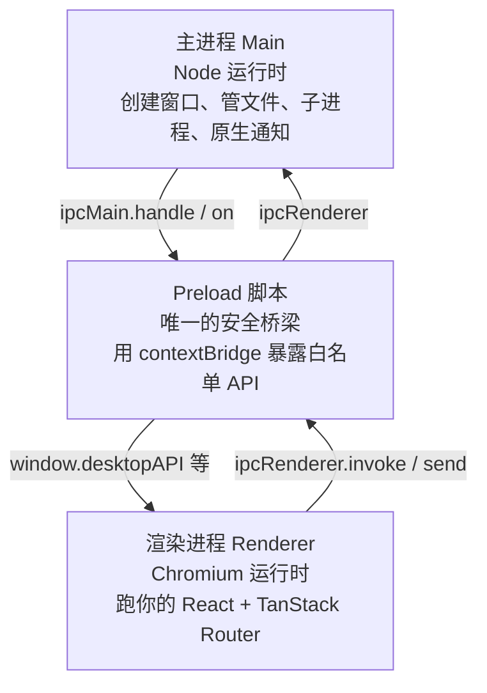
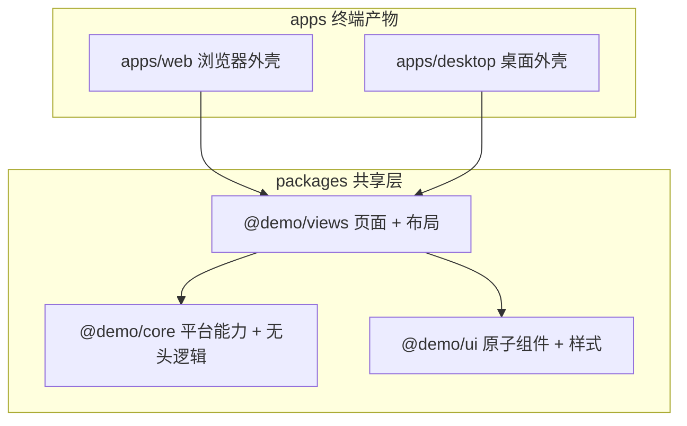
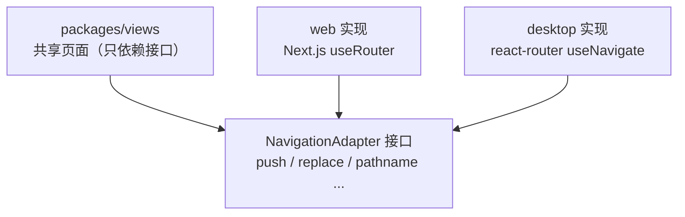
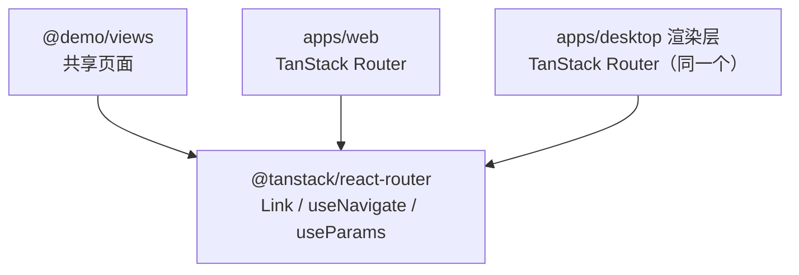

# 01 · 架构与思维模型（阶段 0）

> 阶段 0 不写代码。目标是把「为什么要这么设计」讲透。理解了这一篇，后面所有代码都只是填细节。
>
> 本文会反复对照 multica 的真实代码——它们都在 `/root/Projects/Agents/multica` 下，用反引号标注的路径可直接对照阅读。

---

## 1. 从 web 到 desktop：思维迁移

你熟悉 web 开发，所以用它当锚点。下表是**最重要的认知迁移**——理解它，Electron 就不难了。

| 维度 | 你熟悉的 web | 要学的 Electron desktop |
|---|---|---|
| 谁在跑代码 | 浏览器一个 JS 运行时 | **三个运行时**：主进程（Node）、Preload（受限 Node）、渲染进程（Chromium） |
| 路由 | URL + 路由库 | 渲染进程里的路由库（**没有地址栏**，URL 只是内部状态） |
| 跟操作系统交互 | 几乎不能（浏览器沙箱） | 主进程能读写文件、起子进程、弹原生通知、注册自定义协议 |
| 进程间通信 | HTTP / WebSocket | **IPC**（`ipcMain` ↔ `ipcRenderer`），靠 preload 用 `contextBridge` 暴露 |
| 产物 | 部署到服务器的 bundle | `.dmg` / `.exe` / `.AppImage` 安装包，内含一个 Chromium |
| 入口 | 浏览器打开 URL | `electron → main/index.ts` 起窗口，窗口再加载渲染层 |

**第一性原理的总结**：Electron 本质上是「**把一个 Node 进程和一个 Chromium 浏览器打包进同一个桌面应用，让它们互相通信**」。Node 那一半管操作系统能力，Chromium 那一半跑你熟悉的 React。**Preload 是这两者之间唯一被允许传话的中间人。**

> 朴素结论：你写的 React 代码，在 Electron 里和在浏览器里**几乎是同一份**——区别只在于「想调用系统能力时要走一条更安全的通道（IPC + preload）」。这就是 web/desktop 能复用的根本前提。

---

## 2. Electron 的三进程模型



- **主进程（Main）**：整个应用的「总控」。只有一个。它用 Node 的能力，负责创建窗口、管理生命周期、读写文件、起子进程、发原生通知。对应 multica 的 `apps/desktop/src/main/index.ts`。
- **渲染进程（Renderer）**：每个 `BrowserWindow` 里跑着一个 Chromium，加载你的 React SPA。它和浏览器里的页面**几乎一样**——默认拿不到 Node，只能用网页 API。对应 multica 的 `apps/desktop/src/renderer/`。
- **Preload**：在渲染进程里、网页脚本之前执行的一段脚本。它是**唯一**被允许同时接触 Node（受控）和网页 `window` 的地方。它用 `contextBridge.exposeInMainWorld` 把一组**白名单方法**挂到 `window` 上，渲染层只能调这些方法。对应 multica 的 `apps/desktop/src/preload/index.ts`。

**为什么是三层而不是两层？** 出于安全。早期 Electron 让渲染层直接 `require('electron')`，结果是网页内容（最容易受恶意输入污染的部分）拥有了完整 Node 权限——等于把 root shell 挂在网页里。现代做法用 preload + contextBridge 做白名单隔离。这是 Electron 安全模型的基石，阶段 5 会详谈。

> **dev 与 prod 的加载区别**（这条是 Electron 最经典的开发模式，multica `apps/desktop/src/main/index.ts:310`）：
>
> 开发时，主进程让窗口加载 Vite dev server 的地址（`window.loadURL('http://localhost:5173')`），于是你享受热更新；生产时，加载打包进应用里的静态文件（`window.loadFile('.../renderer/index.html')`）。
>
> 类比你熟悉的 web：dev server 相当于 `vite dev`，loadFile 相当于 `vite build` 后伺候静态产物——只不过产物是**本地文件**而不是 HTTP 服务。

---

## 3. monorepo 全景与包职责

为什么要 monorepo？因为 web 和 desktop 要**共用代码**，共用代码必须放在一个独立的、两边都能引用的包里。pnpm workspace 让一个仓库里的多个包能互相 `import`。

完成态的结构（与 multica 同构）：



三个共享包各有**硬约束**，记住这条，后面「这行代码该放哪」就能自己判断：

| 包 | 职责 | 硬约束（不能做什么） |
|---|---|---|
| `@demo/ui` | 原子组件（Button、Sidebar 等）+ 共享样式 token | 不能 import `@demo/core`；不含业务逻辑 |
| `@demo/views` | 业务页面 + 布局外壳（DashboardLayout 等） | 不能写平台专属的系统调用（要用能力抽象，见第 5 节） |
| `@demo/core` | 平台能力接口、无头业务逻辑、共享类型 | 不能碰 `react-dom`、`localStorage`、DOM、UI 库 |

**依赖方向单向**：`views → ui + core`；`ui` 和 `core` 互相独立。不允许出现循环（比如 `ui` 反过来依赖 `views`）。

> 对照 multica：它的 `packages/ui` 里明确「不能 import `@multica/core`」，`packages/views`「不能 import `next/*` 或 `react-router-dom`」（因为它的 web 用 Next、desktop 用 react-router，两边不同）。**你的情况不同——见下一节。**

---

## 4. 钥匙概念：multica 为什么需要「导航适配器」

这是理解 multica 整个前端架构的钥匙，也解释了**为什么你的项目会比它更简单**。先讲 multica 的问题。

### multica 的问题

multica 的共享页面（比如 Issues 列表，在 `packages/views` 里）要被 web 和 desktop **同时**使用。但两端的导航方式**根本不同**：

- web 端用 Next.js，跳转靠 `next/navigation` 的 `useRouter().push()`
- desktop 端用 react-router-dom，跳转靠 `router.navigate()`，还要经过它特有的「多标签 / 跨工作区」逻辑

如果共享页面直接 `import { useRouter } from 'next/navigation'`，它就被焊死在 web 上，desktop 用不了。反过来也一样。

### multica 的解法：定义一个接口，各平台各自实现

multica 在 `packages/views/navigation/types.ts` 定义了一个平台无关的接口：

```ts
// multica: packages/views/navigation/types.ts
export interface NavigationAdapter {
  push(path: string): void;
  replace(path: string): void;
  back(): void;
  pathname: string;
  searchParams: URLSearchParams;
  openInNewTab?: (path: string, title?: string, opts?: { activate?: boolean }) => void; // 桌面专有
  getShareableUrl: (path: string) => string;
  prefetch?: (path: string) => void; // web 专有
}
```

共享页面里**永远**通过 `useNavigation()` 拿到这个接口、用 `<AppLink>` 做链接，**绝不**直接 import 平台路由库。于是：

- web 实现：`apps/web/platform/navigation.tsx` 把 adapter 转发给 Next.js 的 `router`
- desktop 实现：`apps/desktop/src/renderer/src/platform/navigation.tsx` 转发给「当前活动标签的内存路由器」

这是**依赖倒置**：共享层依赖一个抽象接口，各平台提供具体实现。把平台耦合关进两个小目录，剩下的代码保持纯净。



---

## 5. 你的栈带来的简化：TanStack Router 通吃

这里是**你和 multica 最大的不同，也是你省力的地方**。

multica 之所以被迫拆成「Next.js（web）+ react-router（desktop）」并发明 `NavigationAdapter`，是因为 **Next.js 是 SSR / 服务端组件架构，很难干净地塞进 Electron 的渲染层**。两套路由 API 不一样，才需要接口隔离。

而你的栈是 **Vite + TanStack Router**。TanStack Router 是**纯客户端路由**，在浏览器和 Electron 渲染层里跑的是**同一套代码、同一个 API**。于是：



**共享页面可以直接用 TanStack Router 的 `Link`、`useNavigate`、`useParams`**，不需要中间抽象层。两端的路由配置几乎可以共享。

> 这不是「偷懒」，而是你的技术选型**消除了一个原本必要的复杂度**。这就是第一性原理的价值——不被「multica 这么做所以我也要这么做」绑架，而是看清每个抽象**为什么存在**，再判断自己是否需要它。multica 需要 `NavigationAdapter`，是因为它 web 用 Next.js；你不需要，是因为你两端同构。

### 但你仍需要抽象的：平台能力

路由能共享，**不代表所有差异都消失了**。web 和 desktop 在「调用操作系统 / 浏览器原生能力」时仍然不同：

| 场景 | web 怎么做 | desktop 怎么做 |
|---|---|---|
| 打开外链 | `window.open(url)` | 主进程 `shell.openExternal(url)`（经 IPC） |
| 原生通知 | `new Notification(...)` | 主进程 `new Notification(...)`（经 IPC） |
| 读本地文件 | 几乎不能 | 主进程文件系统（经 IPC） |
| 系统菜单 / 对话框 | 没有 | 主进程 `dialog`（经 IPC） |

这些差异**不能**靠路由同构解决，必须用**同一个抽象**：在 `@demo/core` 定义一个「平台能力接口」，web 和 desktop 各自实现，在 Provider 里注入。共享页面只调接口，不关心底层。

这正是 multica 也做的事——它的 `window.desktopAPI`（preload 暴露）就是 desktop 端的能力实现，web 端则用浏览器 API。我们会在**阶段 5**亲手搭这套抽象。**这是你真正需要从 multica 学走的核心理念**，比路由适配器更重要。

---

## 6. 一句话记住

> **路由同构（TanStack Router）让你省掉 multica 的 `NavigationAdapter`；但「平台能力抽象」你必须学，因为打开外链、通知、文件这类系统调用，web 和 desktop 永远不同。**

整篇文章压缩成一条依赖规则：

```
apps/web ─┐
          ├─→ @demo/views ─→ @demo/ui
apps/desktop ─┘            └→ @demo/core（平台能力接口）
```

- `@demo/views` 里的页面：用 TanStack Router 做导航（两端共享），用 `@demo/core` 的能力接口做系统能力（两端各实现）。
- `@demo/ui` 纯组件，谁都能用。
- `@demo/core` 无头，定义接口、提供类型。

---

## 自测（确认你理解了再进阶段 1）

能用自己的话回答以下问题，就可以进入阶段 1：

1. Electron 的三个进程分别是什么？为什么需要 preload 这一层？
2. dev 模式和 prod 模式下，Electron 窗口分别怎么加载渲染层？
3. 为什么 multica 要发明 `NavigationAdapter`？你的项目为什么不需要？
4. 哪一类差异是你**仍然**需要抽象的？它放在哪个包？
5. `@demo/ui` 能不能 import `@demo/core`？为什么？

如果某题卡住，回到对应小节重读。准备好了，告诉我，我们从**阶段 1（monorepo 化）**开始动手。
