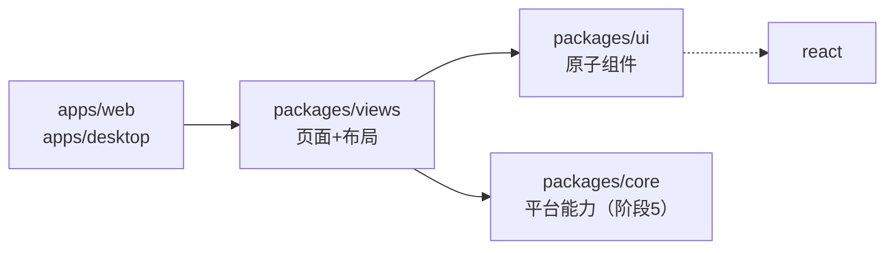
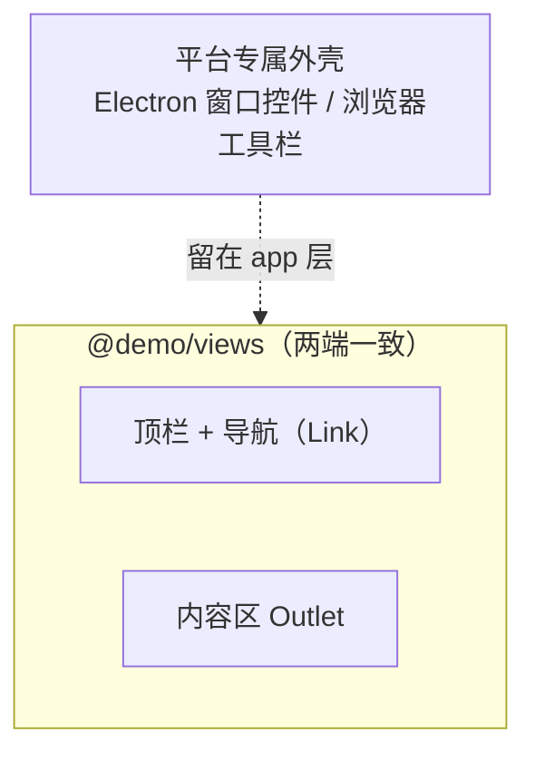

# 04 · 阶段 3 — 抽取 `packages/views`

> 目标：建立第二个共享包 `@demo/views`，承载**页面与布局外壳**；把 `apps/web` 的路由改成「薄路由文件 → 共享视图」模式。验证：web 首页与顶部布局外壳都来自 `@demo/views`，改 `@demo/views` 或 `@demo/ui` 源码 web 即时热更新。核心收获：**因为两端都用 TanStack Router，路由层可直接共享，不需要 multica 的 `NavigationAdapter`**。

---

## 1. 为什么 views 要独立于 ui

| 包 | 装什么 | 依赖谁 |
|---|---|---|
| `@demo/ui` | 原子组件（Button、Input…）、样式 token | 只依赖 React + cva/clsx，**不依赖路由** |
| `@demo/views` | 页面、布局外壳、业务组合 | 依赖 `@demo/ui` + **TanStack Router**（因为要用 `<Link>`/`<Outlet>`） |

分层的判断标准：**会不会用到路由**。Button 不关心自己在哪个页面，所以归 `ui`；布局外壳要画导航、页面要跳转，必须用路由原语，所以归 `views`。如果把它们塞进 `ui`，`ui` 就被迫依赖 `@tanstack/react-router`，原子组件的纯粹性被破坏，desktop 之外（未来可能的纯组件预览）也用不干净。

依赖方向（硬约束，单向，无环）：



> 本阶段 `@demo/views` 暂不依赖 `@demo/core`（平台能力接口要等阶段 5）。现在它只用 `@demo/ui` + 路由。

---

## 2. 核心模式：薄路由文件 → 共享视图

TanStack Router 的 **file-router** 模式，路由树由 `@tanstack/router-plugin` 扫描 `apps/web/src/routes/` 自动生成（`routeTree.gen.ts`）。路由**定义**（`createFileRoute('/')`、路径、懒加载边界）天然是 **app 专属**——web 和 desktop 各自的路由树可以不同。

但路由**渲染的组件**可以共享。于是切法是：

```ts
// apps/web/src/routes/index.tsx —— 薄路由文件
import { createFileRoute } from '@tanstack/react-router'
import { HomeView } from '@demo/views/home/home-view'

export const Route = createFileRoute('/')({ component: HomeView })
```

路由文件只做一件事：把路径 `/` 绑定到共享组件 `HomeView`。`HomeView` 的全部 UI 逻辑在 `@demo/views` 里，两端都能用。

**判据**：路由文件里不该有业务 JSX；业务 JSX 都在 `@demo/views`。这样换到 desktop（阶段 4）时，只需在 `apps/desktop` 写一份**等价的薄路由文件**指向同一个 `HomeView`，页面就搬过去了。

---

## 3. 最关键的设计判断：路由同构省掉导航适配器

这是本项目相对 multica 的**最大简化**，必须理解。

### 3.1 multica 为什么需要 NavigationAdapter

multica 的 web 用 **Next.js**（`next/link`、`useRouter`），desktop 渲染层用 **react-router-dom**（`<Link>`、`useNavigate`）。两套路由 API **不同**。如果共享页面直接写 `next/link`，desktop 端就崩；写 react-router，web 端就崩。

multica 的解法（`packages/views/navigation/types.ts`）：定义一个 `NavigationAdapter` 接口（`navigate`、`Link` 等抽象），web 端实现成 Next 版、desktop 端实现成 react-router 版，共享页面只依赖接口。**多了一整层抽象**。

### 3.2 我们为什么不需要

我们 web 与 desktop 渲染层**都用 TanStack Router**，API 完全一致。所以 `@demo/views` 里直接写：

```tsx
import { Link, Outlet } from '@tanstack/react-router'

<Link to="/">首页</Link>          // 两端都能跑
<Outlet />                        // 两端行为一致
const navigate = useNavigate()    // 两端都能用
```

**不需要** `NavigationAdapter`。这是当初选 TanStack 的核心回报——省掉一层抽象、少一套要维护的适配实现。

### 3.3 前提：两端只有「一份」TanStack Router

`<Link>`/`<Outlet>` 依赖 React Context（路由器实例挂在 context 上）。如果 web 和 `@demo/views` 各装一份 `@tanstack/react-router`，`<Outlet>` 在 `@demo/views` 里就找不到 `apps/web` 注入的路由 context，页面空白且无报错——典型的「两份实例」陷阱（和「两个 React」同类）。

防御：把 `@tanstack/react-router` 放进 `pnpm-workspace.yaml` 的 `catalog:`，`apps/web` 与 `packages/views` 都写 `"catalog:"`，pnpm 只装一份、版本永远一致。本阶段就是这么做的（catalog 里新增了 react-router 条目）。

> 一句话：**路由同构省掉导航适配器；平台能力抽象不可省**（打开外链、通知、文件，web 与 desktop 永远不同，留到阶段 5 的 `@demo/core`）。这是贯穿后续所有阶段的心智。

---

## 4. 布局外壳：共享到什么程度

`AppLayout`（`packages/views/layout/app-layout.tsx`）提供「**两端一致的应用框架**」：顶部栏、导航、内容区（`<Outlet/>`）。这部分 web 和 desktop 长得一样，所以归 `@demo/views`。



**不放在 `@demo/views` 的**：平台专属外壳——Electron 的自定义标题栏/窗口控件、浏览器独有的地址栏交互等。这些留在 app 层（`apps/desktop` / `apps/web`），通过把 `AppLayout` 嵌进各自的根外壳来实现组合。本阶段先做最小外壳，阶段 6 复刻 multica 时再丰富导航。

---

## 5. 操作清单（本阶段做的事）

1. `pnpm-workspace.yaml`：catalog 新增 `@tanstack/react-router`（web + views 共用、统一版本）。
2. 新建 `packages/views/`：`package.json`（exports 指向 `./layout/*`、`./home/*`；依赖 `@demo/ui` workspace + react-router catalog；react/react-dom peer）、`tsconfig.json`、`layout/app-layout.tsx`、`home/home-view.tsx`。
3. `apps/web/package.json`：加 `@demo/views: workspace:*`；`@tanstack/react-router` 改 `catalog:`。
4. `apps/web/src/styles.css`：加 `@source "../../../packages/views";`（让 Tailwind 扫描 views 里的类）。
5. `apps/web/src/routes/__root.tsx`：渲染 `<AppLayout />`（内含 `<Outlet/>`）替代裸 `<Outlet/>`。
6. `apps/web/src/routes/index.tsx`：改成薄路由，`component: HomeView`。
7. 用户手动：`pnpm install` → `pnpm typecheck` → `pnpm build` → `pnpm dev:web`。

---

## 6. 关键文件要点

### 6.1 `packages/views/package.json`

```jsonc
{
  "exports": {
    "./layout/*": "./layout/*.tsx",
    "./home/*": "./home/*.tsx"
  },
  "dependencies": {
    "@demo/ui": "workspace:*",            // 组合原子组件
    "@tanstack/react-router": "catalog:"  // 用 Link/Outlet，版本走 catalog
  },
  "peerDependencies": { "react": "catalog:", "react-dom": "catalog:" }
}
```

和 `@demo/ui` 一样**导出原始源码**，由消费方的 Vite 编译。react/react-dom 仍是 peerDependencies（由 app 提供），避免装第二份。

### 6.2 `packages/views/layout/app-layout.tsx`

直接 `import { Link, Outlet } from '@tanstack/react-router'`——这就是「路由同构」的物证。换成 multica 的写法，这里会是 `import { Link } from '@multica/views/navigation'`（适配器）。

### 6.3 `apps/web/src/routes/__root.tsx`

根路由组件渲染 `<AppLayout />`。`AppLayout` 内部的 `<Outlet/>` 解析到当前匹配的子路由（这里是 `/` → `HomeView`）。devtools 留在根组件、`AppLayout` 之外。

### 6.4 `apps/web/src/styles.css`

```css
@source "../../../packages/ui";
@source "../../../packages/views";
```

两个共享包的类都要被 Tailwind 扫描，缺一个对应包里的类就不生效。

---

## 7. 验证（用户手动执行）

```bash
pnpm install     # 链接 @demo/views、应用 react-router catalog
pnpm typecheck   # 现在覆盖 @demo/ui + @demo/views + @demo/web
pnpm build
pnpm dev:web     # 看顶栏 + 首页；改 @demo/views 或 @demo/ui 源码应热更新
```

判据：

- `pnpm install` 无 `ERR_PNPM`；`@demo/views` 被识别为工作区成员。
- `pnpm typecheck` 三个包都过。
- `pnpm dev:web` 打开 `http://localhost:3000`：顶部有「desktop-web-demo + 首页」外壳，下方是 Button 演示；点「首页」是 TanStack `<Link>`（无刷新跳转）。
- 改 `packages/views/home/home-view.tsx` 文案 → 页面热更新；改 `packages/views/layout/app-layout.tsx` 顶栏 → 热更新。

---

## 8. 小结

`@demo/views` 让「页面」也变成可共享的东西：web 渲染的首页和顶栏，源码都在 `packages/views`。关键是**薄路由文件**模式——路由树各端自有、组件两端共用。而能这么干的前提是两端路由同构（TanStack），所以**没有** NavigationAdapter。下一步阶段 4 引入 Electron：在 desktop 渲染层再挂一份薄路由指向同一个 `HomeView`，亲手验证「一份页面、两个外壳」。
