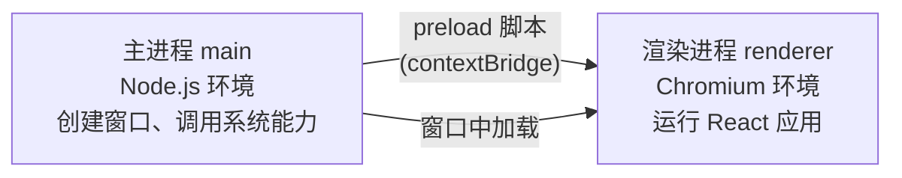

# 05 路 阶段 4: 引入 Electron

> 目标：搭起 `apps/desktop`，让 Electron 窗口显示和 web 一样的共享 UI。
> 这一章除了讲清三进程模型，还要强调一个工程约定：**Electron 项目优先用官方脚手架初始化，再按本仓库架构做裁剪和接入，不要从零手写整套 `package.json` 和目录结构。**

---

## 1. 为什么这里不建议“纯手写初始化”

前几章里，`packages/ui`、`packages/views` 这类共享包可以直接手写，因为它们本质上只是普通 TypeScript 包。

但 `apps/desktop` 不一样。Electron 初始化涉及：

- `electron-vite` 的三段构建配置
- Electron 主进程 / preload / renderer 的默认目录约定
- `main` 字段、开发脚本、构建脚本
- Electron 二进制依赖与安装脚本
- Windows / macOS / Linux 下脚手架默认的一些兼容处理

这些东西如果完全自己拼，短期能跑，长期却容易偏离官方模板，后面查文档、对照社区示例、升级版本时都会变得更难。

所以这一步更合理的学习方式是：

1. **先用官方脚手架生成一个最小 Electron 项目**
2. **再把它搬进 `apps/desktop`**
3. **最后按本仓库的 monorepo 边界，接入 `@demo/views` 与共享依赖**

这比完全手写更符合真实项目实践。

---

## 2. 推荐的初始化方式

以 `electron-vite` 生态为例，优先使用它的官方脚手架生成项目，再纳入 monorepo。

常见做法是先在临时目录执行：

```bash
pnpm create @quick-start/electron@latest
```

或使用当前 `electron-vite` 文档推荐的等价脚手架命令。

然后在交互里选择：

- 框架：`react`
- 语言：`typescript`

得到一个能单独运行的 Electron + React + TypeScript 基线项目后，再把其中与 desktop 外壳相关的部分迁入本仓库的 `apps/desktop/`。

这一点很重要：

> 本项目要学的是“如何把官方 Electron 外壳接进共享前端架构”，不是“如何从零默写一份 Electron 脚手架”。

---

## 3. 正确的心智顺序

这一章建议按下面顺序推进：

1. 先用官方脚手架起一个最小可运行的 Electron 项目
2. 确认它单独能跑
3. 再把它移动到 monorepo 的 `apps/desktop`
4. 再替换 renderer，让它改为渲染 `@demo/views`
5. 再补齐 workspace 依赖、turbo 脚本与类型检查

这样做的好处：

- 你能知道哪些是 Electron 官方模板自带的
- 你能区分“脚手架默认值”和“本项目自己的架构决策”
- 后面如果升级 `electron-vite`，你知道该先去对照谁

---

## 4. 哪些部分是“脚手架给的”，哪些是“我们自己改的”

### 脚手架通常会给你的

- `apps/desktop/package.json`
- `electron.vite.config.ts`
- `src/main/index.ts`
- `src/preload/index.ts`
- `src/renderer/` 入口
- `dev` / `build` 脚本

### 本项目在脚手架之上要做的改造

- 包名改成 `@demo/desktop`
- 挂进 `pnpm-workspace.yaml`
- 根 `package.json` 增加 `dev:desktop`
- `turbo.json` 纳入 `out/**`
- renderer 改成使用 TanStack Router
- renderer 改成复用 `@demo/views`
- 通过 workspace 依赖接入 `@demo/ui` / `@demo/views` / `@demo/core`
- 处理 React 去重与版本一致性

也就是说：

> `apps/desktop` 的“壳”应该尽量靠近官方模板；而“如何接入共享包、如何遵守 monorepo 边界”才是本教程真正要讲的内容。

---

## 5. Electron 三进程模型

这一部分与是否脚手架初始化无关，仍然是必须掌握的基础。



| 进程 | 运行环境 | 职责 |
|---|---|---|
| `main` | Node.js | 应用生命周期、窗口、系统 API |
| `preload` | 受控桥层 | 向 renderer 暴露白名单能力 |
| `renderer` | Chromium | 跑 React 页面 |

项目的真正共享部分只发生在 `renderer` 层。

---

## 6. dev 与 prod 的加载分支

这一章要保留的核心实现判断仍然不变：

```ts
if (is.dev && process.env['ELECTRON_RENDERER_URL']) {
  mainWindow.loadURL(process.env['ELECTRON_RENDERER_URL'])
} else {
  mainWindow.loadFile(join(__dirname, '../renderer/index.html'))
}
```

含义：

- 开发时连 Vite dev server
- 生产时加载打包后的本地 HTML

这属于 Electron 外壳的基本结构，通常也是脚手架默认就会生成的内容之一。

---

## 7. 我们在本项目里真正要验证的，不是“能不能手写脚手架”

本阶段的关键验证应改成：

1. 用官方脚手架生成的 Electron 项目能单独启动
2. 把它迁入 `apps/desktop` 后仍能启动
3. renderer 改为渲染共享的 `AppLayout` 与 `HomeView`
4. `pnpm dev:desktop` 能打开 Electron 窗口
5. 修改 `packages/views` 后，desktop renderer 能热更新

这样验证的焦点才对：

- 外壳来自官方模板
- 共享页面来自 monorepo
- 我们学习的是“接线与分层”

---

## 8. 这章的操作建议

如果你重做这一章，推荐流程是：

```bash
# 先在临时目录生成官方模板
pnpm create @quick-start/electron@latest

# 确认模板单独能跑
pnpm install
pnpm dev
```

然后再把需要的文件迁入本仓库 `apps/desktop/`，并做这些改造：

- 改包名与脚本
- 接入 workspace 依赖
- 把 renderer 换成 TanStack Router
- 把页面换成 `@demo/views`
- 把根脚本和 turbo 接上

---

## 9. 小结

这一章要吸收的经验不是“Electron 可以手写起来”，而是：

> Electron 外壳优先复用官方脚手架；本教程真正要教的是如何把这个外壳纳入 monorepo，并让 renderer 去复用共享页面。

这样后续阶段的关注点才能留在正确的位置：

- 阶段 5：平台能力抽象
- 阶段 6：复刻 multica 风格主 UI

而不是把精力浪费在维护一份偏离官方模板的手写初始化上。
