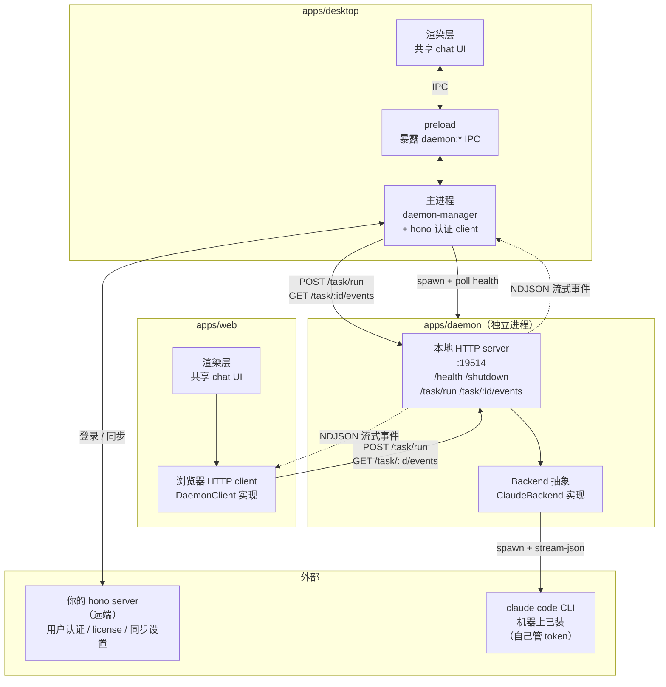

# 00 · 学习计划（总纲）

> 本文是 daemon 学习系列的总纲。读完它，你应当能回答三个问题：**最终要做出什么**、**分几步做**、**每一步的「完成」长什么样**。

---

## 1. 起点、终点、差距

**起点（你已经有的）**

- `apps/web` + `apps/desktop`：渲染层已经在跑，共享 `packages/views`、`packages/ui`、`packages/core`。
- 你已经有 multica daemon 的 Go 源码可参照：`D:\Projects\src\multica\server\internal\daemon\`、`D:\Projects\src\multica\server\pkg\agent\`、`D:\Projects\src\multica\apps\desktop\src\main\daemon-manager.ts`。
- 仓库总约束已扩展：这一系列允许新增 `apps/daemon`，但仍**不引入云端 task server**。

**终点（要达到的）**

一个**纯本地**的 AI coding 工具链：desktop 可拉起 daemon，web 与 desktop 共享同一套 chat UI；用户在任一壳里写 prompt → daemon 调机器上的 `claude` → 流式把输出返回 UI。

具体组件：

- `apps/daemon`：Node.js + TypeScript 的本地 agent runtime：
  1. 健康端口 19514（`/health` + `/shutdown`）。
  2. Task HTTP API：`POST /task/run`（接 prompt）、`GET /task/:id/events`（NDJSON 流式输出）、`DELETE /task/:id`（取消）。
  3. Backend 接口抽象：阶段 4 实现 `ClaudeBackend`（spawn `claude -p ... --output-format stream-json`），为后续接入 openclaw/hermes/pi 留路。
  4. 优雅关闭：信号 + `/shutdown` 双路径，正在跑的 task 有超时强杀。
- `apps/desktop` 扩展：
  - `daemon-manager.ts`：spawn/stop `apps/daemon` 子进程，poll `/health`，把状态通过 IPC 推给渲染层。
  - 渲染层 `daemon-panel.tsx` + `chat-view.tsx`：通过注入的 `DaemonClient` 显示状态、写 prompt、看流式输出。
  - claude code 引导安装：首次启动检测 `claude --version`，缺失时引导 `npm install -g @anthropic-ai/claude-code`。
- `apps/web` 扩展：
  - 注入 HTTP 版 `DaemonClient`：浏览器直接连接 `http://127.0.0.1:19514`。
  - 复用同一套 `chat-view.tsx`：daemon 已运行时可直接对话，未运行时显示连接状态与引导。
- 远端 hono server：只做**用户认证**（登录、license、同步设置），**不参与 task 分发**，daemon 完全不与它通信。

**差距（要补的能力）**

1. Node.js 长跑服务的套路：信号处理、abort 传播、健康端口、结构化日志。
2. 用 `child_process.spawn` 管理子进程的完整生命周期（stdin 写入、stdout 流式读、stderr 捕获、退出码、超时 kill）。
3. NDJSON 流式 HTTP 响应（daemon → Electron）。
4. 并发任务的「优雅关闭」——多个 `setInterval` 协同退出，不漏写、不孤儿进程。
5. 共享 `DaemonClient` 抽象：desktop 走 IPC 适配，web 走浏览器 HTTP 适配。
6. Electron 把 daemon 子进程状态同步到 renderer 的 IPC 模式。
7. Electron 打包时把 daemon 作为 `extraResource` 随安装包分发。

---

## 2. 核心学习目标

按优先级排列：

1. **「daemon = 旁路进程」的心智模型**：为什么不把 agent 执行塞进 Electron 主进程；这个决定的三个后果（崩溃隔离、独立升级、可独立调试）。
2. **Node.js 子进程流式处理**：会用 `spawn` + `AbortController` 控制一个「写 prompt 到 stdin、从 stdout 读 stream-json」的子进程。
3. **本地 HTTP server 设计**：`/health`（liveness/readiness）+ `/shutdown`（优雅停服）+ task API（推 task、流式回事件、取消）。
4. **Backend 抽象**：设计一个能同时支持 claude/openclaw/hermes/pi 的接口（实现先只做 claude）。
5. **Electron 集成**：daemon-manager 状态机、IPC 推送、claude 引导安装、打包 extraResource。

---

## 3. 目标架构

下图是完成态。daemon 对外统一暴露 localhost HTTP；desktop 通过主进程桥接它，web 直接连接它；hono server 只服务 shell 的用户认证，不与 daemon 直接交互。

> 对照 multica：它的 daemon 和 cloud server 双向 HTTP（poll + heartbeat + post result），我们改成 **shell → daemon 单向 HTTP**（推 task + 收流式）。desktop 通过 main 进程桥接，web 直接连 HTTP；daemon 没有「远端 server」可连，它的全部输入来自本机壳子。

---

## 4. 八阶段学习路径

| 阶段 | 主题 | 核心学到 | 完成标志 |
|---|---|---|---|
| **0** | 架构与思维模型 | 产品形态、为什么独立进程、与 multica 的差异 | 能口述 daemon 生命周期与数据流（本文档 `01`） |
| **1** | 项目骨架 | `apps/daemon` 最小可启动、`tsx watch`、信号处理 | `pnpm dev:daemon` 起来，Ctrl-C 干净退出 |
| **2** | Config + Logger | env 加载、`zod` 校验、pino 结构化日志 | `daemon.config.ts` 读到环境变量并打印 |
| **3** | Health HTTP server | `node:http`、`/health` + `/shutdown`、端口冲突检测 | `curl localhost:19514/health` 返回 JSON |
| **4** | Claude backend | `Backend` 接口、spawn、stream-json 解析、abort | 手动跑 `ClaudeBackend.execute()` 能拿到流式消息 |
| **5** | Task HTTP API + NDJSON | `POST /task/run`、`GET /task/:id/events` 流式、`DELETE` 取消 | curl 推 task，curl 收到 NDJSON 流 |
| **6** | Shell 集成 | `DaemonClient`、desktop IPC 适配、web HTTP 适配、chat UI | desktop 能启动并对话；web 在 daemon 已运行时也能对话 |
| **7** | 打包 + 引导安装 | electron-builder extraResource、claude 引导 | 装出来的 desktop 能直接用 |

---

## 5. 各阶段详解

### 阶段 1 · 项目骨架

- **目标**：在 `apps/daemon` 下建一个最小 Node.js 程序，能被 `pnpm dev:daemon` 跑起来。
- **关键概念**：`apps/*` 已被 `pnpm-workspace.yaml` 覆盖；`tsx` 直接跑 `.ts`；`SIGINT` / `SIGTERM` 的优雅退出；`AbortController` 作为「单点关闭开关」。
- **产出**：
  - `apps/daemon/package.json`、`tsconfig.json`
  - `apps/daemon/src/main.ts`（最小入口）
- **验证**：`pnpm dev:daemon` 起来后每秒打一行 log；Ctrl-C 后 100ms 内干净退出。

### 阶段 2 · Config + Logger

- **目标**：环境变量与默认值收敛到 `Config` 类型，用 pino 打结构化日志。
- **关键概念**：`override > env > default` 模式、`zod` 校验、pino 的 `level` / `pretty` transport、日志文件滚动。
- **产出**：
  - `apps/daemon/src/config.ts`
  - `apps/daemon/src/logger.ts`
  - `packages/core/daemon/config.ts`（共享类型）
- **验证**：`DEMO_DAEMON_HEALTH_PORT=20000 pnpm dev:daemon` 打出的 log 里能看到 `healthPort=20000`。

### 阶段 3 · Health HTTP server

- **目标**：起 19514 端口的本地 HTTP server，暴露 `/health` + `/shutdown`。
- **关键概念**：`node:http` 原生 server、`127.0.0.1` 绑定、端口占用识别「另一个 daemon 在跑」、`/shutdown` 通过 abort 触发优雅退出、`liveness ≠ readiness`。
- **产出**：
  - `apps/daemon/src/health/server.ts`
  - `apps/daemon/src/health/types.ts`
- **验证**：
  - `curl http://127.0.0.1:19514/health` 返回 `{"status":"starting",...}`
  - `curl -X POST http://127.0.0.1:19514/shutdown` 后 daemon 在 500ms 内退出
  - 端口冲突时报错文案清晰

### 阶段 4 · Claude backend

- **目标**：实现 `Backend` 接口 + `ClaudeBackend`，spawn `claude` 子进程、流式解析 stream-json。
- **关键概念**：`Backend` 接口设计（`execute()` 返回 `AsyncIterable<Message>`）、`spawn` + stdin 写 prompt + stdout 读流、stream-json 行缓冲解析、AbortSignal 传递 + Windows 下 `taskkill /T`、stderr tail 捕获。
- **产出**：
  - `apps/daemon/src/agent/backend.ts`（接口 + `Message` 类型）
  - `apps/daemon/src/agent/claude.ts`（`ClaudeBackend`）
  - `apps/daemon/src/agent/stream-json.ts`（NDJSON 解析器）
  - `apps/daemon/src/agent/probe.ts`（探测 claude 是否在 PATH）
- **验证**：写一个 cli 脚本，`backend.execute({ prompt: "What is 2+2?" })` 能拿到完整流式消息 + 最终结果。

### 阶段 5 · Task HTTP API + NDJSON 流式输出

- **目标**：在 health server 上加 `POST /task/run`、`GET /task/:id/events`、`DELETE /task/:id`。
- **关键概念**：task ID 生成与状态管理（pending / running / done / failed / cancelled）、`POST /task/run` 立即返回 ID 后台执行、`GET /task/:id/events` 用 NDJSON 流式推事件、`taskStore` 先回放历史事件再转 live 订阅以避免丢首包、`DELETE` 通过 abort 取消、并发上限。
- **产出**：
  - `apps/daemon/src/task/store.ts`（任务存储 + pub/sub）
  - `apps/daemon/src/task/router.ts`（HTTP 路由）
  - `apps/daemon/src/task/runner.ts`（任务执行器，组合 Backend）
- **验证**：
  - `curl -X POST http://127.0.0.1:19514/task/run -d '{"prompt":"hi"}'` 返回 `{"task_id":"t1"}`
  - `curl http://127.0.0.1:19514/task/t1/events` 看到 NDJSON 流（text / tool_use / tool_result / result）
  - `curl -X DELETE http://127.0.0.1:19514/task/t1` 后流结束

### 阶段 6 · Shell 集成

- **目标**：在 `@demo/core` 定义 `DaemonClient` 接口；`apps/desktop` 提供 IPC 适配；`apps/web` 提供 HTTP 适配；共享 chat UI 只依赖这层抽象。
- **关键概念**：daemon-manager 状态机（`installing / starting / running / stopped`）、poll `/health` 间隔、spawn 命令 dev/prod 差异（dev: `tsx watch`、prod: `node resources/daemon/daemon.js`）、desktop renderer 只看 IPC、web renderer 直接用浏览器 fetch + NDJSON、共享视图不感知传输细节。
- **产出**：
  - `packages/core/daemon/client.ts`（`DaemonClient` 接口）
  - `apps/desktop/src/main/daemon-manager.ts`
  - `apps/desktop/src/main/ipc/daemon.ts`
  - `apps/desktop/src/preload/index.ts` 扩展
  - `apps/web/src/lib/daemon-client.ts`
  - `packages/views/src/daemon/daemon-panel.tsx`
  - `packages/views/src/daemon/chat-view.tsx`（写 prompt、看流式输出）
- **验证**：desktop 里点「Start daemon」，5 秒内状态变 `running`；在 chat 里写「hello」，看到流式回复；web 端在 daemon 已运行时打开同一页面，也能看到流式回复；「Stop daemon」干净退出。

### 阶段 7 · 打包 + 引导安装

- **目标**：打出来的 desktop 安装包能直接用。
- **关键概念**：electron-builder 的 `extraResources` 把 daemon 产物 bundle 进去；首次启动检测 `claude --version`，缺失时引导安装；Windows 平台特有事项（隐藏子进程窗口、PATH 后缀、npm global 路径探测）。
- **产出**：
  - `apps/daemon/tsup.config.ts`（打包配置）
  - `apps/desktop/electron-builder.yml` 加 extraResources
  - `apps/desktop/src/main/claude-installer.ts`（引导安装）
  - `apps/desktop/src/renderer/src/components/claude-missing-banner.tsx`
- **验证**：在干净 Windows 机器上装 desktop 首次启动 → 检测 claude → 提示安装 → 装好后 → 写 prompt → 收到回复。

---

## 6. 关键决策与约定

这些是贯穿全系列的既定决策（用户 2026-06-22 拍板）：

1. **语言：TypeScript on Node.js ≥ 20**（原生 `fetch` / `AbortController` / `--watch`）。
2. **包前缀**：`@demo/`。daemon 是 `@demo/daemon`。
3. **共享类型放 `packages/core`**，不新建 `packages/daemon-core`。`@demo/core/daemon/*` 子路径只放类型和纯函数。
4. **产品形态：纯本地 AI coding 桌面应用**。hono server 只做用户认证（登录 / license / 同步设置），**不参与 task 分发**。daemon 不持有 Claude 凭证——claude CLI 自己管 token。
5. **通信架构（1A）**：daemon 对外统一暴露 localhost HTTP。desktop main 负责 spawn/stop 与协议桥接；desktop renderer 经 IPC 调 main；web renderer 直接连接同一套 HTTP API。daemon 的 19514 端口同时承载 health、shutdown、task API、流式输出。
6. **流式输出协议（NDJSON）**：`GET /task/:id/events` 用 `application/x-ndjson`，每行一个 JSON 事件。Node 端和浏览器端都用 `fetch` + `ReadableStream` 读，不用 SSE。
7. **独立进程（3A）**：daemon 是独立本地进程。desktop 是它的 lifecycle owner；web 只连接已运行的 daemon。这样既保留崩溃隔离，也让两端共用一套 HTTP API。
8. **claude 安装（4B）**：Electron 引导安装，**不**bundle claude 二进制（claude 自己更新）。首次启动检测，缺失就引导 `npm install -g @anthropic-ai/claude-code`。
9. **平台策略：Windows-first**，macOS / Linux 兼容性作为延伸。Windows 特有事项集中在 `apps/daemon/src/platform/windows.ts`。
10. **范围裁剪**：**不做** poll loop / heartbeat / register-to-server / workspace sync / profile / auto-update / GC / orphan recovery / repocache。**保留** Config / Logger / Health / Backend / Task API / Electron 集成。
11. **多 agent 抽象**：阶段 4 设计 `Backend` 接口，先实现 `ClaudeBackend`。后续接 openclaw/hermes/pi 只需加文件，不改 task API 与 daemon-manager。
12. **代码注释用简体中文**（对齐项目其余部分），只在意图不明显处写「为什么」。
13. **Git 提交**：每阶段一个提交，遵循 `CLAUDE.md` 第 13 节。

---

## 7. 如何推进

- 每个阶段：先读文档 → 我生成代码 → 给出验证命令 → 你跑通后确认 → 进入下一阶段。
- 想深入某个概念随时打断（例如「详细讲讲 stream-json 帧格式」、「为什么 stdin 写入必须异步」）。
- 想跳过或调整范围直接说。

**下一步**：阅读 `01-架构与思维模型.md`（阶段 0），建立理论基础。读完告诉我，我们就从阶段 1 开始动手。
