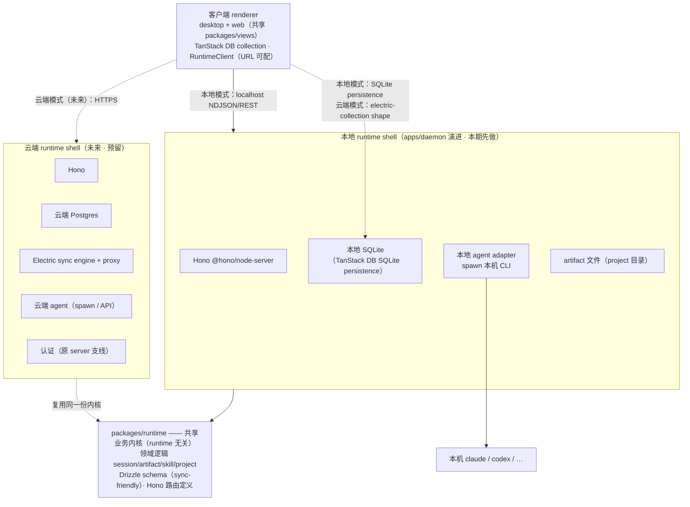
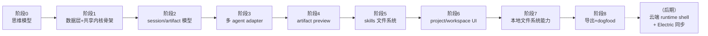

# 00 · 学习计划（总纲）

> 本文是 product 学习系列的总纲。读完它，你应当能回答三个问题：**最终要做出什么产品**、**分几步从现状演进过去**、**每一步的「完成」长什么样**。

---

## 0. 这一系列讲什么

本项目原本的目标是「参照 multica 复刻一套 web + desktop 同步开发的前端」。`frontend/` 支线做完了共享渲染层，`daemon/` 支线做完了本地 agent runtime（spawn claude、19514 端口、流式 chat）。

**现在我们要把这两条线组装成一个真正的产品**：一个 **local-first、能干活的通用 agent 工作台**。

产品形态参考 [`nexu-io/open-design`](https://github.com/nexu-io/open-design)——但**只取它的架构精髓，不限定在「设计」领域**：

- **local-first**：数据在本地（本地 SQLite），agent 在本地跑，不依赖云端即可用。
- **agent-native、model-agnostic**：自己不实现 agent，spawn 机器上**已装的** coding-agent CLI（`claude` / `codex` / …），用户一键切换。
- **artifact-first**：agent 的产出不是一段 chat 文字，而是**可预览、可迭代、可导出的「产物」**（artifact）——代码、文档、原型、配置、脚本。
- **三层可组合文件系统**：skills（`SKILL.md`，agent 的「能力/品味」）、（可选）项目上下文约定、project（用户真实的工作文件夹）。

**关键判断**：我们**不走 multica 的 linear issue/task 分发模式**。multica 是「用户在 web 建 issue → server 派发给某台机器的 daemon → 执行 → 回传」的流水线。我们做的是「用户在工作台直接发起任务 → agent 在用户的项目里干活 → 产出 artifact → 多轮迭代」的工作室模式。multica 在这里只作为**架构参考**。

**两个面向未来的架构决策**（本支线的核心特色，详见第 6 节）：

1. **双 runtime 模式**：agent runtime 可跑在**本地**（桌面 daemon，web 也能连），也可跑在**云端**（server，用户不依赖本机装 CLI）。用户自行选择。**起步只做本地，架构预留云端**。
2. **local-first + 未来云端同步**：本地 SQLite 是数据主权（离线可用），schema 从第一天起 sync-friendly，未来云端 runtime 模式走 ElectricSQL（Postgres 主 + TanStack DB electric-collection 同步）。

> 与 `AGENTS.md` 的关系：本支线是**产品总纲**，统领 `frontend/`（渲染层）与 `daemon/`（本地 runtime）。它不改写 monorepo 的包边界规则，而是**新增一个共享业务内核包**（`packages/runtime`）+ 把 `apps/daemon` 演进成本地 runtime shell。原 `server/` 支线（认证）暂停——未来它会被重新激活为「云端 runtime shell」（见第 6 节决策 4）。

---

## 1. 起点、终点、差距

**起点（你已经有的）**

- `apps/web` + `apps/desktop`：共享渲染层（`packages/views` / `packages/ui` / `packages/core`），有 `/` 与 `/daemon` 两个页面、统一布局 + sidebar + 主题、双端 `DaemonClient`（IPC / fetch）。
- `apps/daemon`：本地 agent runtime，`daemon/` 八阶段全部完成——`Backend` 抽象（`execute → AsyncIterable<Message>`）、`ClaudeBackend`（spawn `claude -p --output-format stream-json`）、task 状态机、NDJSON 流式 append-only 回放、abort 杀进程树、并发上限、`/health` + `/shutdown` + `/task/*` HTTP API（裸 `node:http`）、claude onboarding、`daemon-manager` 状态机。
- 有两份可对照的源码：**multica**（`D:\Projects\src\multica\`，daemon + adapter 原型）与 **open-design**（`https://github.com/nexu-io/open-design`，artifact-first 工作台产品形态 + `docs/architecture.md` / `roadmap.md` / `skills-protocol.md` / `agent-adapters.md`）。
- 技术栈对齐：TanStack 全家桶（Router 已用），可顺畅接入 **TanStack DB**（本地 SQLite persistence + Electric collection）。

**终点（要达到的）**

一个 local-first 通用 agent 工作台。典型一次使用：

1. 用户 **import 一个本地文件夹**作为 project（或新建空 project）。
2. 选一个 **agent**（机器上已装的 CLI）+ 可选一个 **skill**（`SKILL.md`）。
3. 写任务（brief）→ agent 在 project 目录里**真正干活**（读写文件、跑命令、产出 artifact）。
4. agent 产出的 artifact（HTML / 代码 / markdown / 图片…）在 **sandboxed preview** 里实时预览，边生成边看。
5. 多轮迭代（续接 session、局部修改）；产物落盘 + 元数据进本地 SQLite。
6. **导出**（HTML / ZIP）/ 在文件管理器里打开 project。
7. （未来）切换到**云端 runtime 模式**：同一 UI，agent 在云端 server 跑、数据在云端 Postgres、经 Electric 同步回本地缓存。

支撑它的架构（本支线要建出来的）：

- **共享业务内核 `packages/runtime`**：session/artifact/skill/project 领域逻辑 + Drizzle schema + Hono 路由定义。runtime 无关，本地 shell 与未来云端 shell 复用同一份。
- **本地 runtime shell**（`apps/daemon` 演进）：Hono + 共享内核 + 本地 SQLite + 本地 agent adapter。
- **数据层**：SQLite + Drizzle（元数据/关系/索引）+ 文件（artifact 大内容）；sync-friendly schema。
- **session / artifact 模型 + 多 agent adapter + sandboxed preview + skills + project/workspace UI + 本地文件系统能力 + 导出**。
- **（未来）云端 runtime shell + ElectricSQL 同步**：架构预留，本期不实现。

**差距（要补的能力）**

1. **无共享业务内核**：现在 agent 逻辑全在 `apps/daemon` 里，与 runtime 位置耦合。要抽出 `packages/runtime`，让本地/云端复用。
2. **无结构化存储**：现在 store 纯内存 `Map`，进程重启全丢。要 SQLite + Drizzle，且 schema sync-friendly。
3. **数据模型落后**：task（一次性、内存）要升级为 session（多轮）+ artifact（结构化产物）。
4. **API 层单薄**：裸 `node:http` 手写路由，要上 Hono（也为云端 shell 共享 API 铺路）。
5. **单 agent 写死**：`main.ts` 写死 `ClaudeBackend`，`agent` 字段被忽略；要注册表 + 路由 + 多 agent 探测。
6. **无 artifact / preview**：`tool_result` 截断塞 markdown；要结构化 artifact + sandboxed iframe 预览。
7. **无 skills / project 实体 / 文件系统能力 / 导出**（详见第 5 节各阶段）。
8. **单 runtime**：只支持本地；要抽象 runtime 概念，为云端预留。

---

## 2. 核心学习目标

按优先级排列：

1. **local-first + artifact-first 心智**：为什么数据在本地、为什么 agent 产出「产物」而非「对话」，这两个选择如何决定后续所有设计。
2. **共享业务内核 + 双 runtime 架构**：为什么把领域逻辑抽成 runtime 无关的 `packages/runtime`，让本地 shell 和未来云端 shell 各自套上；为什么这是「方便未来 server」的关键。
3. **把 task 模型演进为 session/artifact 模型**：在复用 `Backend` / `Message` / NDJSON 流式的前提下重塑数据模型与 API。
4. **Hono 作为共享 API 层**：为什么用 Hono 替换裸 `node:http`，以及它如何同时服务本地 daemon 和未来云端 server。
5. **多 agent adapter 注册与路由**。
6. **sandboxed preview 的安全与流式**。
7. **skills 文件系统（`SKILL.md`）**。
8. **SQLite + Drizzle + sync-friendly schema**：为什么混合存储（元数据 SQLite + 内容文件），以及 schema 怎么为未来 ElectricSQL 同步铺路。
9. **本地文件系统能力 + folder import + 继承 agent 权限模型**。
10. **从 demo 到产品**：组装成一个「打开就能干活」的完整工作台。

---

## 3. 目标架构

下图是完成态（本期聚焦左半「本地 runtime」，右半「云端 runtime」为预留）。**核心是中间的共享业务内核 `packages/runtime`**——本地 shell 和未来云端 shell 都依赖它，只是 runtime 适配（agent 在哪跑）与数据主权（SQLite vs Postgres）不同。

| 层 | 本地 runtime 模式 | 云端 runtime 模式（未来） |
|---|---|---|
| agent 在哪跑 | 本地 daemon spawn 本机 CLI | 云端 server spawn / 调 API |
| 数据主权 | **本地 SQLite 主**（纯 local-first、离线） | **云端 Postgres 主** + Electric sync 到本地 |
| 客户端数据访问 | TanStack DB · SQLite persistence | TanStack DB · electric-collection shape |
| API 层 | Hono（本地 daemon） | Hono（云端 server） |
| 业务逻辑 | `packages/runtime`（共享） | `packages/runtime`（共享） |

> 「runtime 模式 ↔ 数据主权」是对应关系：选本地 runtime → 本地 SQLite 主；选云端 runtime → 云端 Postgres 主 + Electric 同步。客户端数据访问统一在 **TanStack DB collection**，只是 backend 换（SQLite persistence vs Electric shape）。

---

## 4. 九阶段学习路径（本期 0–8 聚焦本地 runtime；云端为后期展望）

| 阶段 | 主题 | 核心学到 | 完成标志 |
|---|---|---|---|
| **0** | 架构与思维模型 | 工作台是什么、共享内核+双runtime、local-first+artifact-first | 能口述「folder→agent→artifact→预览」与 runtime 选择（`01`） |
| **1** | 数据层 + 共享内核骨架 | `packages/runtime` 骨架、Drizzle schema（sync-friendly）、Hono 路由骨架、本地 SQLite 迁移；daemon 接入 Hono | daemon 用 Hono 起、SQLite 建表、内核包可被 daemon 引用 |
| **2** | session/artifact 模型与 API | `task` 升级为 `session`+`artifact`；内核领域逻辑 + Hono 路由；`DaemonClient`→`RuntimeClient` 扩展；NDJSON 复用 | 续接 session 多轮；列出/读取 artifact |
| **3** | 多 agent adapter | `backendRegistry` + 按 `session.agent` 路由 + 多 agent 探测（claude + 1） | 选不同 agent 跑同一任务 |
| **4** | artifact-first preview | sandboxed iframe（`srcdoc`、无 allow-same-origin）；代码/markdown/图片预览；流式 parser | agent 产 HTML → iframe 实时预览 |
| **5** | skills 文件系统 | `SKILL.md` 解析、registry 多目录扫描 + FS-watch、picker、注入 | 选 skill → 产物被 skill 改变 |
| **6** | project/workspace UI | project 列表/创建、文件面板、session 历史侧栏、artifact 浏览；替换硬编码 sidebar | 真实 project/session/artifact 浏览 |
| **7** | 本地文件系统能力 | `PlatformCapabilities` 扩展、folder import、agent cwd=真实项目 | import 本地文件夹 → agent 在其中干活 |
| **8** | 导出 + dogfood | artifact 导出（HTML/ZIP）、daemon 随 desktop bundle、端到端 | 干净机器 → import → 干活 → 导出 |
| **后期** | 云端 runtime shell + Electric 同步 | 云端 server shell（复用内核）、Postgres、Electric sync、认证；客户端 runtime URL 切云端 | 同一 UI 切云端模式可用 |

---

## 5. 各阶段详解

### 阶段 1 · 数据层 + 共享内核骨架

- **目标**：建 `packages/runtime` 共享内核骨架 + Drizzle schema（sync-friendly）+ 本地 SQLite；daemon 从裸 `node:http` 切到 Hono。
- **关键概念**：`packages/runtime` 包结构（`domain/` 领域逻辑、`db/schema.ts` Drizzle schema、`http/routes.ts` Hono 路由定义）；**sync-friendly schema**：UUID 主键（`text().primaryKey()`，`crypto.randomUUID()`）、`created_at`/`updated_at`（毫秒时间戳）、软删除 `deleted_at`、`user_id`/`device_id`；Drizzle + `better-sqlite3` 起步（未来切 Postgres 只换 dialect）；Hono `@hono/node-server` 替换 `apps/daemon/src/health/server.ts` 的裸 http。
- **产出**：
  - `packages/runtime/package.json`、`packages/runtime/src/db/schema.ts`、`packages/runtime/src/http/app.ts`（Hono 实例工厂）、`packages/runtime/src/domain/*`
  - `apps/daemon` 接入 Hono + SQLite（替换 `health/server.ts`）
- **验证**：daemon 起来用 Hono 响应 `/health`；SQLite 建表迁移跑通；`packages/runtime` 被 daemon 引用不报错。

### 阶段 2 · session/artifact 模型与 API

- **目标**：`task` 升级为 `session`（多轮）+ `artifact`（结构化产物），领域逻辑进内核，Hono 路由暴露 API。
- **关键概念**：`Session`（绑定 project + agent + skill + 主 artifact）、`Turn`（复用现有 `Message` 流）、`Artifact`（kind = html/code/markdown/image/...）；内核 `domain/session.ts`、`domain/artifact.ts`；Hono 路由 `POST /project/:id/session`、`POST /session/:id/turn`（NDJSON 流式，复用 append-only 回放）、`GET /session/:id`、`GET /project/:id/artifacts`；`DaemonClient` 演进为 `RuntimeClient`（`createSession/runTurn/listArtifacts/...`）；**移除旧 `/task/*`**（不留兼容，AGENTS.md 第 10 节）。
- **产出**：
  - `packages/runtime/src/domain/{session,artifact}.ts`、`packages/runtime/src/http/session-routes.ts`
  - `packages/core/runtime/client.ts`（`RuntimeClient` 接口，替换/扩展 `DaemonClient`）
- **验证**：开 session → 跑 turn → 续接第二个 turn（agent 记得上文）→ `GET /artifacts` 看到产物，元数据进 SQLite。

### 阶段 3 · 多 agent adapter

- **目标**：补通 `agent` 字段——注册表按 agent 路由 backend，探测多个 CLI。
- **关键概念**：`backendRegistry: Map<string, () => Backend>`；session manager 按 `session.agent` 取 backend；扩展 `probe`（现只探 claude）为多 agent 并行探测；至少 claude + 一个（`codex` 或 `api-fallback`）；adapter 契约：Detect → Spawn（cwd=project dir + skill context）→ Stream（原生帧 → 统一 `Message`）→ Report capabilities。下游领域逻辑/路由/类型不动。
- **产出**：`apps/daemon/src/agent/registry.ts`、`apps/daemon/src/agent/codex.ts`（或 api-fallback）、扩展 `probe.ts`。
- **验证**：`/health.agents` 列多个；同一任务选不同 agent 各自正常。

### 阶段 4 · artifact-first preview

- **目标**：agent 产出 artifact 在 sandboxed iframe 实时预览。
- **关键概念**：`<iframe sandbox srcdoc>`（**无** `allow-same-origin`）；按 artifact kind 分发（HTML→srcdoc、代码→高亮、markdown→渲染、图片→img）；流式 parser：agent 每次写触发 debounce 100ms 重建 `srcdoc`；artifact 事件在 NDJSON 流带结构化 `artifact` 字段。
- **产出**：`packages/views/product/artifact-preview.tsx`、`packages/runtime/src/preview/pipeline.ts`、扩展 session 事件类型。
- **验证**：agent 产 HTML → iframe 实时预览；artifact JS 访问不到 host 的 `window`/cookie。

### 阶段 5 · skills 文件系统

- **目标**：`SKILL.md` 可扫描、热重载、picker 选、注入 agent run。
- **关键概念**：`SKILL.md`（Claude Code 兼容 + 可选 `demo:` frontmatter）；registry 扫 `./.demo/skills` > `./skills` > `~/.demo/skills` 按优先级合并；`chokidar` FS-watch；agent run 注入 skill 内容为 system prompt；`GET /skill` + picker UI。
- **产出**：`packages/runtime/src/skill/{registry,parser}.ts`、`packages/runtime/src/http/skill-routes.ts`、`packages/views/product/skill-picker.tsx`、`skills/<示例>/SKILL.md`。
- **验证**：drop skill 文件夹 → 不重启出现在 picker → 选中影响产物。

### 阶段 6 · project / workspace UI

- **目标**：真实数据替换硬编码 sidebar；project/session/artifact 可浏览。
- **关键概念**：project 列表/创建/import；workspace 文件面板（隐藏 `node_modules`/`.git`）；session 历史侧栏（从 SQLite 读真实数据）；artifact 浏览；新路由 `/projects`、`/projects/$id`、`/sessions/$id`。客户端用 **TanStack DB collection** 读本地 SQLite（为阶段统一数据访问 + 未来 Electric 打基础）。
- **产出**：`packages/views/product/{project-list,workspace,session-sidebar,artifact-browser}.tsx`、两端薄路由、重写 `app-sidebar.tsx`。
- **验证**：创建 project → 跑 session → sidebar 出现该 session → 点进去看到 artifact。

### 阶段 7 · 本地文件系统能力

- **目标**：agent 在用户真实项目里干活（folder import），且安全。
- **关键概念**：`PlatformCapabilities` 扩展（`openPath`/`pickDirectory`/`readFile`/`writeFile`/`showInFolder`）；desktop IPC 桥；folder import：`realpath` 规范化 + `resolveSafe` 越界检查，agent cwd=project dir；**继承 agent 自己的权限模型**（Claude Code `--allowed-tools`），不发明沙箱。
- **产出**：扩展 `packages/core/platform/types.ts`、`apps/desktop/src/main/ipc/fs.ts` + preload、web 降级实现、`packages/runtime/src/domain/project.ts`（folder import + 安全校验）。
- **验证**：import 文件夹 → agent 读写 → artifact 出现在该文件夹 → 「打开文件夹」可用。

### 阶段 8 · 导出 + dogfood

- **目标**：从「能跑」到「能交付」。
- **关键概念**：导出 HTML（内联 CSS、asset 转 data URI）、ZIP（`archiver`）；daemon 随 desktop bundle（已有 `extraResources` + `ELECTRON_RUN_AS_NODE`，复用）；端到端 dogfood。
- **产出**：`packages/runtime/src/export/{html,zip}.ts`、`packages/views/product/export-menu.tsx`、dogfood 清单。
- **验证**：干净 Windows 装 desktop → 全流程跑通 → 导出 HTML 单文件双击可看。

### 后期展望 · 云端 runtime shell + Electric 同步

- **目标**：复用 `packages/runtime` 内核，建云端 server shell，支持云端 runtime 模式。
- **关键概念**：`apps/server`（原 server 支线升级）= Hono + 共享内核 + 云端 Postgres + Electric sync engine/proxy + 认证 + 云端 agent（spawn/API）；客户端 `RuntimeClient` URL 切云端、TanStack DB 切 electric-collection shape；`packages/runtime` 的 Drizzle schema 从 SQLite dialect 切 Postgres dialect（schema 基本不动，因 sync-friendly 设计）。
- **验证**：同一 UI 切「云端 runtime」→ agent 在云端跑 → 数据 Electric 同步回本地。

---

## 6. 关键决策与约定

1. **演进现有 daemon 为「本地 runtime shell」**（非重写）：`Backend`/`Message`/NDJSON/`daemon-manager`/claude onboarding 全部复用。task 模型**升级**为 session/artifact，**移除**旧 `/task/*`（不留兼容，AGENTS.md 第 10 节）。
2. **共享业务内核 = 新建 `packages/runtime`**：领域逻辑（session/artifact/skill/project）+ Drizzle schema + Hono 路由定义。**runtime 无关**——本地 shell 与未来云端 shell 复用同一份。这是「方便未来 server」的关键：云端 shell 只需套上同一内核，不重写业务。`@demo/core` 继续放纯类型/接口，`@demo/runtime` 放有依赖的领域逻辑。
3. **Hono 作共享 API 层**：替换 daemon 裸 `node:http`。同一套路由定义既能跑本地 daemon（`@hono/node-server`），又能跑未来云端 server——双 runtime 共享 API 的基础。
4. **双 runtime（本地先做、云端预留）**：抽象 `Runtime`/`RuntimeClient` 概念。**本期只做本地 runtime shell**，但保证共享内核 + runtime 接口 + 客户端 URL 可配，云端 shell 作为后期阶段。**runtime 模式 ↔ 数据主权**：本地→本地 SQLite 主；云端→云端 Postgres 主 + Electric sync。
5. **存储：SQLite + Drizzle（元数据）+ 文件（artifact 内容），混合**。元数据/关系/索引进 SQLite（查询、事务、sync）；artifact 大内容（HTML/代码/图片）写文件（git-reviewable、可外部编辑）。推翻 open-design 的纯 plain files——它数据简单且不做 sync；我们要关系 + 未来 sync，SQLite 更合适。
6. **schema 从第一天 sync-friendly**：UUID 主键（`crypto.randomUUID()`）、`created_at`/`updated_at` 毫秒时间戳、软删除 `deleted_at`、`user_id`/`device_id`。这些是 ElectricSQL / 任意 sync 引擎的共同前提。本地阶段就按此设计，未来切云端零返工。
7. **未来云端同步 = ElectricSQL（Postgres-centric）**：云端 Postgres 主 + TanStack DB `electric-collection`（shape sync、乐观写 + `txid` 匹配）+ Electric proxy（认证/shape 授权）。**本地模式用 TanStack DB 的 SQLite persistence**（本地 SQLite 主、离线）。客户端数据访问统一在 TanStack DB collection，backend 换 SQLite/Electric 即可。实现留到云端阶段。
8. **preview**：`<iframe sandbox srcdoc>`，**无** `allow-same-origin`；按 artifact kind 分发；debounce 100ms 重建。
9. **安全模型**：daemon 绑 `127.0.0.1`（已有）；preview sandboxed；agent cwd 限定 project dir + `realpath`/`resolveSafe` 防越界；**继承 agent 自己的权限模型**（Claude Code `--allowed-tools`），不发明自己的沙箱。
10. **skills**：`SKILL.md`（Claude Code 格式 + 可选 `demo:` frontmatter），registry 扫三处按优先级合并，`chokidar` FS-watch，agent run 注入为 system prompt。
11. **design-system（`DESIGN.md`）弱化为可选/延伸**：通用向非设计向，作为 skill 的「项目上下文注入」机制。
12. **渲染层沿用 Vite + TanStack + Electron 共享**（不换 Next.js）。代价：云端模式需自建 server shell（无 Vercel direct），但学习项目可接受。
13. **明确不做（本期；作延伸/后期）**：云端 runtime shell（后期阶段）、comment mode、sliders、sidecar（EVAL/SCREENSHOT/CLICK）、BYOK proxy、MCP server、PDF/PPTX/MP4 export、多用户/auth（随云端 shell）、skill marketplace。
14. **平台策略**：Windows-first，macOS/Linux 兼容作延伸。
15. **代码注释简体中文**（AGENTS.md 第 10 节）；**每阶段一个提交**（第 13 节）。

---

## 7. 如何推进

- 每个阶段：先读文档 → 写代码 → 给出验证命令 → 你跑通后确认 → 进入下一阶段（与 `daemon/` 同节奏）。
- **本次先交付入口三件套**：本篇 `00`、`01-架构与思维模型.md`、`README.md`。锚定产品定位、共享内核+双runtime 架构、阶段路径与技术选型。确认后从阶段 1（数据层 + 共享内核骨架）动手。
- 阶段依赖：**1（数据层+内核骨架）→ 2（session/artifact）→ 3/4/5（多agent/preview/skills，可调换）→ 6（UI）→ 7（文件系统）→ 8（导出）**。云端 runtime shell 是 8 之后的后期展望。
- 想深入某概念随时打断；想调整范围直接说（如「云端同步先不做，schema 也不必 sync-friendly」「先不抽 runtime 包」）。

**下一步**：阅读 `01-架构与思维模型.md`（阶段 0），建立 local-first + artifact-first + 共享内核/双 runtime 的理论基础。读完告诉我，我们就从阶段 1 开始动手。
