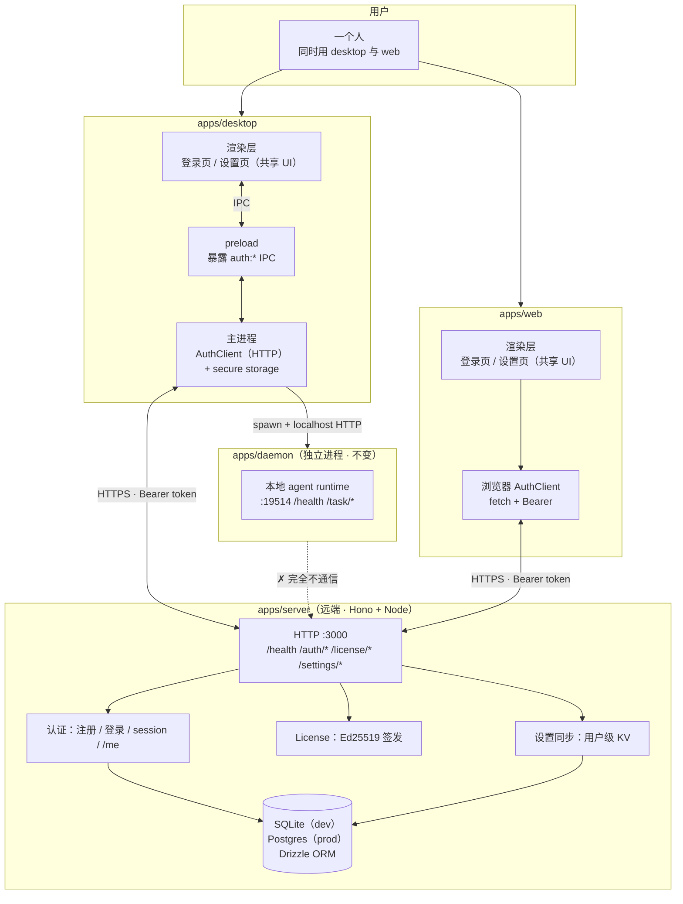
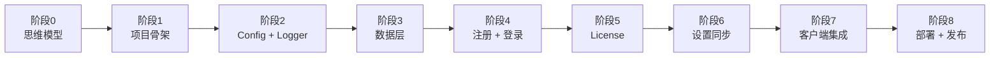

# 00 · 学习计划（总纲）

> 本文是 server 学习系列的总纲。读完它，你应当能回答三个问题：**最终要做出什么**、**分几步做**、**每一步的「完成」长什么样**。

---

## 0. 这一系列讲什么

在 `daemon/` 系列的目标架构图里，我们画过一个被刻意「晾在远处」的方块：

> **你的 hono server（远端）—— 用户认证 / license / 同步设置**

`daemon/00` 的「关键决策 4」也写明了：daemon 不持有任何凭证，claude CLI 自己管 token；而**用户身份**（登录、license、设置同步）由一个**远端 server** 负责，**daemon 完全不与它通信**。

那个方块当时只画了个框，没有展开。**这一系列就是把它展开**：用一个 **Hono + TypeScript** 写的远端服务，把「用户认证 / license / 设置同步」三件事做出来，并让 desktop 与 web 两个壳子通过一个共享的 `AuthClient` 接口连接它。

> 与 `AGENTS.md` 第 6 节的关系：那条约束否定的是 **multica 的 Go cloud task server**（task 分发、多机协同、daemon 编排）。本系列做的是**认证边缘服务**，**不碰 task 分发**，daemon 依旧只认本机壳子的 localhost HTTP。两者不冲突——认证 server 在数据流上和 daemon 是两条平行的线，永不相交。

---

## 1. 起点、终点、差距

**起点（你已经有的）**

- `apps/web` + `apps/desktop`：渲染层在跑，共享 `packages/views` / `packages/ui` / `packages/core`。
- `apps/daemon`：本地 agent runtime 已完成（`daemon/` 系列八阶段全部做完），19514 端口跑着 health + task API。
- 你已经有 multica 的 Go server 源码可**对照阅读**：`D:\Projects\src\multica\server\`（`internal/auth/`、`internal/handler/auth.go`、`internal/middleware/auth.go`、`migrations/`、`pkg/db/`）。
- daemon 文档已经替我们写好了「认证由远端 server 负责」的约定，本系列只需兑现它。

**终点（要达到的）**

一个**远端**的 Hono + TypeScript 服务，对外只做三件事，**没有 task、没有 agent、没有 daemon 编排**：

1. **用户认证**：注册、登录、登出、取当前用户（`/me`）。密码用 argon2id hash，会话用 opaque session token（Bearer header）。
2. **License**：签发与校验。server 用 Ed25519 私钥签发 license token，client（desktop）用公钥**离线验签**。
3. **设置同步**：用户级 KV（语言、时区、偏好等），多端读写一致（对照 multica 的 `/api/me`）。

它的 client 是两个壳子，各自注入同一个 `AuthClient` 接口实现：

- `apps/desktop`：主进程持 HTTP 版 `AuthClient`，token 存 Electron secure storage，renderer 经 IPC 调主进程。
- `apps/web`：renderer 持浏览器版 `AuthClient`（直接 `fetch`），token 存浏览器（httpOnly cookie 或内存 + sessionStorage）。

`apps/daemon` **完全不变**：它既不是这个 server 的 client，也不被它管理。两条线平行。

具体新增组件：

- `apps/server`：`@demo/server`，Hono + Node + Drizzle。入口、config、logger、数据层、auth、license、settings 路由、中间件。
- `packages/core/server/*`：传输无关的 `AuthClient` 接口、协议 schema（注册/登录/`/me`/license/settings 的请求与响应类型）。对齐 `packages/core/daemon/*` 的下沉模式。
- `apps/desktop` 扩展：主进程 `AuthClient`（HTTP）+ secure storage 读写 + IPC 暴露；renderer 登录页与设置页。
- `apps/web` 扩展：浏览器 `AuthClient`（fetch）+ 登录页与设置页；CORS 由 server 限到 web origin。

**差距（要补的能力）**

1. 用 Hono 搭一个生产可用的 TS HTTP 服务：路由、中间件链、JSON body、统一错误处理、`/health`。
2. Drizzle ORM + SQLite 的 schema 定义、`drizzle-kit` 迁移、查询；以及「SQLite 起步 → 生产 Postgres」的切换边界。
3. **密码认证全链路**：argon2id 注册、登录校验、opaque session token 生成/校验/撤销、Bearer 中间件、登录限流。
4. **离线 license 的非对称签名**：Ed25519 密钥对、签发、客户端公钥验签（为什么不用对称、为什么不查表）。
5. 设置同步的 KV schema 与多端语义（last-write-wins 起步，冲突作为延伸）。
6. 把通信抽象成 `AuthClient` 下沉 `@demo/core`，desktop 与 web 各实现，共享登录/设置 UI。
7. Electron secure storage（`safeStorage` / keytar）存 token；web 端 token 存储选型。
8. 把一个 TS 服务真正部署到远端：Docker、env、生产 Postgres、TLS、CI。

---

## 2. 核心学习目标

按优先级排列：

1. **「认证 server = daemon 之外的独立远端边缘服务」心智模型**：为什么用户认证不能塞进 daemon、也不能塞进 Electron 主进程；这个决定的后果（凭证集中、可独立部署、与 agent 执行解耦）。
2. **Hono + Drizzle + SQLite 的现代 TS 后端最小套路**：路由 / 中间件 / schema / 迁移 / 查询，一套能跑能部署的骨架。
3. **密码认证的安全闭环**：hash、session token、中间件、限流、撤销——理解每一步防的是什么。
4. **离线 license 的非对称签名设计**：为什么 Ed25519、为什么 client 离线验签、为什么 server 只签发不查表。
5. **设置同步的多端一致性心智**：KV 模型、last-write-wins、何时需要更复杂的冲突解决。
6. **`AuthClient` 抽象**：让 desktop（IPC over main）与 web（浏览器 fetch）共享同一套登录/设置 UI，传输细节藏在适配层。
7. **部署一个真实远端服务**：从 `tsx watch` 到 Docker + Postgres + TLS + CI。

---

## 3. 目标架构

下图是完成态。server 远端独立部署，desktop 主进程与 web renderer 都是它的 client（Bearer token over HTTPS）；daemon 依旧是本机 localhost 服务，与 server **完全不通信**。

> 对照 multica：它的 server 是 **task 中枢**（派发 issue → daemon claim → 跑 agent → 回传结果），认证只是边缘一小块。我们**只裁这一小块边缘**（auth + user 表 + `/api/me` 设置同步 + 自加的 license），整条 task 管线（`internal/daemon` / `daemonws` / `scheduler` / `pkg/agent`）明确不取。详见 `01` 的对照表。

---

## 4. 九阶段学习路径

| 阶段 | 主题 | 核心学到 | 完成标志 |
|---|---|---|---|
| **0** | 架构与思维模型 | server 是什么、为什么独立于 daemon、与 multica server 的差异 | 能口述认证数据流（本文档 `01`） |
| **1** | 项目骨架 | `apps/server` 最小 Hono、`@hono/node-server`、`tsx watch`、信号处理、`/health` | `pnpm dev:server` 起，`curl /health` 返 JSON |
| **2** | Config + Logger | env 加载、`zod` 校验、pino 结构化日志（对齐 daemon 阶段 2） | `PORT=4000 pnpm dev:server` 读到并打印 |
| **3** | 数据层 | Drizzle ORM + SQLite、schema、`drizzle-kit` 迁移；对照 multica sqlc/Postgres | 迁移跑通，`user` 表可插可查 |
| **4** | 注册 + 登录 | argon2id hash、opaque session token、Bearer 中间件、登录限流 | 注册→登录→拿 token→`GET /me` 通过 |
| **5** | License | Ed25519 密钥对、签发 license token、client 离线验签 | 签发后 client 用公钥离线验签通过 |
| **6** | 设置同步 | 用户级 KV schema、多端 last-write-wins（对照 multica `/api/me`） | 两端 PUT 同一设置，互查一致 |
| **7** | 客户端集成 | `AuthClient` 下沉 `packages/core/server/*`、desktop secure storage + IPC、web 浏览器 fetch、共享登录/设置 UI | 两端登录→拿 token→同步设置，UI 同构 |
| **8** | 部署与发布 | Dockerfile、env、生产 Postgres 切换、TLS、CI | 容器跑起来，HTTPS 可注册登录 |

---

## 5. 各阶段详解

### 阶段 1 · 项目骨架

- **目标**：在 `apps/server` 下建一个最小 Hono 程序，能被 `pnpm dev:server` 跑起来，暴露 `/health`。
- **关键概念**：`apps/*` 已被 workspace 覆盖；Hono 用 `@hono/node-server` 跑在 Node；`tsx watch` 热重载；`SIGINT`/`SIGTERM` 优雅关闭（对齐 daemon 阶段 1 的 `AbortController` 单点关闭）。
- **产出**：
  - `apps/server/package.json`、`apps/server/tsconfig.json`
  - `apps/server/src/main.ts`（最小入口：起 Hono + `/health`）
- **验证**：`pnpm dev:server` 起来后 `curl http://localhost:3000/health` 返回 `{"status":"ok"}`；Ctrl-C 干净退出。

### 阶段 2 · Config + Logger

- **目标**：环境变量与默认值收敛到 `Config` 类型，用 pino 打结构化日志。
- **关键概念**：`override > env > default` 模式、`zod` 校验（端口、JWT/session secret、DB 路径、license 私钥路径、CORS origin）、pino 的 `level` / `pretty` transport。**与 daemon 阶段 2 同构**，可大量复用心智。
- **产出**：
  - `apps/server/src/config.ts`
  - `apps/server/src/logger.ts`
  - `packages/core/server/config.ts`（共享 `ServerConfig` schema）
- **验证**：`PORT=4000 DEMO_SERVER_LOG_LEVEL=debug pnpm dev:server` 打出的 log 里能看到 `port=4000`。

### 阶段 3 · 数据层

- **目标**：用 Drizzle 定义 schema、跑迁移，落地 `user` 与 `session` 两张表。
- **关键概念**：Drizzle 的 `sqliteTable` / 列定义 / 外键；`drizzle-kit generate` + `migrate`；为什么 Drizzle（类型安全、查询即 SQL、迁移可控）而非 Prisma（运行时重、生成客户端）或 sqlc（Go 生态，TS 无对应）。**对照 multica 的 Postgres + sqlc**：我们在 TS 里用 Drizzle + SQLite 复刻同等心智（写 SQL 风格的查询、生成类型），生产再切 Postgres（Drizzle 抽象让 dialect 切换成本低）。
- **产出**：
  - `apps/server/src/db/schema.ts`（`users`、`sessions` 表）
  - `apps/server/src/db/client.ts`（Drizzle 实例）
  - `apps/server/drizzle.config.ts`
- **验证**：`pnpm db:migrate` 跑通；写一段脚本插一条 user、查回来。

### 阶段 4 · 注册 + 登录

- **目标**：实现 `POST /auth/register`、`POST /auth/login`、`POST /auth/logout`、`GET /me`，加 Bearer 中间件与登录限流。
- **关键概念**：argon2id 注册 hash（`@node-rs/argon2`）；opaque session token（随机 bytes + SHA-256 存表，DB 只存 hash，token 本身只返回一次）；Bearer 中间件解 token → 查 session → 注入 `ctx.user`；登录限流（per-IP / per-email 固定窗口）。**为什么 opaque token 而非 JWT**：client 是非浏览器（desktop app）+ 浏览器，opaque token 可撤销、可失效、教学上能讲 session 表；multica 用 JWT + cookie 是因为它面向浏览器且追求无状态（见 `01` 取舍）。
- **产出**：
  - `apps/server/src/auth/password.ts`（argon2id hash/verify）
  - `apps/server/src/auth/session.ts`（session 生成/校验/撤销）
  - `apps/server/src/auth/router.ts`（register/login/logout/me）
  - `apps/server/src/middleware/auth.ts`（Bearer 中间件）
  - `apps/server/src/middleware/ratelimit.ts`（登录限流）
- **验证**：
  - `curl POST /auth/register -d '{"email":"a@b.c","password":"..."}'` → `{token}`
  - `curl GET /me -H "Authorization: Bearer <token>"` → 用户信息
  - 错密码连续 N 次后被限流

### 阶段 5 · License

- **目标**：server 用 Ed25519 私钥签发 license token，client（desktop）用公钥**离线验签**。
- **关键概念**：非对称签名（server 私钥签、client 公钥验，client 不需要联网校验、也无法伪造）；license payload（用户、到期、特性位、nonce）；为什么 Ed25519（短、快、纯签名、无 RSA 的参数坑）；为什么离线验签（desktop 离线也要能用、降低 server 依赖）。**注意**：multica **没有** license 子系统，所以这一阶段没有 multica 对照，是本项目的自我设计——`01` 会讲清设计原理。
- **产出**：
  - `apps/server/src/license/keys.ts`（密钥对加载/生成）
  - `apps/server/src/license/sign.ts`（签发 license token）
  - `packages/core/server/license.ts`（license payload 类型 + 验签纯函数，供 client 复用）
- **验证**：签发一个 license，在 client 端用公钥离线验签通过；篡改 payload 后验签失败；过期 license 验签失败。

### 阶段 6 · 设置同步

- **目标**：用户级 KV，`GET/PUT /settings`，多端读写一致。
- **关键概念**：KV 表（`user_id` + `key` + `value(jsonb/text)` + `updated_at`）；last-write-wins（按 `updated_at` 取最新）；对照 multica 的 `/api/me`（它把 language/timezone/profile 作为 `user` 列，PATCH `/api/me` 同步——我们用更通用的 KV 表，但心智一致）。冲突解决（版本号 / CRDT）作为延伸。
- **产出**：
  - `apps/server/src/settings/schema.ts`（`user_settings` 表）
  - `apps/server/src/settings/router.ts`（GET/PUT）
- **验证**：desktop PUT `{theme:"dark"}`，web GET 拿到 `{theme:"dark"}`；并发写以 `updated_at` 最新者为准。

### 阶段 7 · 客户端集成

- **目标**：在 `@demo/core` 定义 `AuthClient` 接口；desktop 主进程提供 HTTP + secure storage 适配，web 提供浏览器 fetch 适配；共享登录/设置 UI 只依赖接口。
- **关键概念**：`AuthClient` 接口（`register/login/logout/me/getSettings/putSettings`）；desktop 主进程持 token 于 Electron `safeStorage`（或 keytar），renderer 经 IPC 调主进程；web renderer token 存 httpOnly cookie（登录响应由 server set-cookie）或内存；共享 `packages/views` 的登录页/设置页不感知传输细节。**与 daemon 阶段 6 的 `DaemonClient` 同构**——同一个抽象模式，不同的协议（这里是远端 HTTPS，不是 localhost）。
- **产出**：
  - `packages/core/server/client.ts`（`AuthClient` 接口）
  - `packages/core/server/client-context.tsx`（React Context 注入，对齐 `packages/core/daemon/client-context.tsx`）
  - `apps/desktop/src/main/auth-client.ts` + `apps/desktop/src/main/ipc/auth.ts` + preload 扩展
  - `apps/web/src/lib/auth-client.ts`
  - `packages/views/src/auth/login-view.tsx`、`settings-view.tsx`
- **验证**：desktop 登录→token 进 secure storage→`/me` 显示用户；web 登录→token 进 cookie/storage→`/me` 显示用户；两端改设置互相同步。

### 阶段 8 · 部署与发布

- **目标**：把 server 打成 Docker 镜像，连生产 Postgres，挂 TLS，跑通 CI。
- **关键概念**：多阶段 Dockerfile（build TS → 跑 `node`）；env 注入（`DATABASE_URL`、`LICENSE_PRIVATE_KEY`、`CORS_ORIGIN`）；Drizzle dialect 从 SQLite 切 Postgres（换 `drizzle.config.ts` 的 dialect + driver，schema 基本不动）；TLS 由反代（Caddy/Traefik/Cloudflare）终结；CI 跑 `typecheck` + `db:migrate` + 镜像构建。
- **产出**：
  - `apps/server/Dockerfile`
  - `apps/server/src/db/client.ts` 支持按 env 选 SQLite/Postgres
  - `.github/workflows/server*.yml`
- **验证**：本地 `docker compose up`（server + postgres）起来；`https://<域名>/health` 返回 ok；注册登录跑通。

---

## 6. 关键决策与约定

这些是贯穿全系列的既定决策（基于 `daemon/00` 的伏笔 + 本系列定位）：

1. **语言：TypeScript on Node.js ≥ 20**（对齐 daemon，原生 `fetch` / `AbortController` / `crypto`）。
2. **Web 框架：Hono**（运行时无关，本项目用 `@hono/node-server` 跑在 Node）。选型理由见 `01`。
3. **包前缀**：`@demo/`。server 是 `@demo/server`（`apps/server`）。
4. **共享类型放 `packages/core/server/*`**，对齐 `packages/core/daemon/*`：只放接口、schema、纯函数（如 license 验签）。
5. **数据库：SQLite（`better-sqlite3`）+ Drizzle ORM 起步**，生产切 Postgres。Drizzle 的 dialect 抽象让切换成本低。
6. **密码：argon2id**（`@node-rs/argon2`，预编译二进制）。OWASP 当前首选。
7. **会话：opaque session token**（存 `sessions` 表、SHA-256 hash、可撤销），Bearer header。**不用 JWT 做会话**——取舍见 `01`。
8. **License：Ed25519 签名 token**，server 私钥签、client 公钥离线验。multica 无此子系统，自设计。
9. **登录方式：密码起步**（multica 是邮箱验证码；验证码需邮件服务，起步太重）。验证码 / OAuth 作为延伸。
10. **范围（重申 AGENTS.md 第 6 节）**：**只做**用户认证 / license / 设置同步。**不做** task 分发、daemon 编排、多机协同、OAuth/SSO、RBAC、计费、邮件验证、多工作区、realtime 推送。
11. **通信**：Bearer token over HTTPS；CORS 限 `apps/web` origin；daemon 不连本 server。
12. **平台**：开发跨平台 Node；部署目标是 Linux 容器。
13. **代码注释用简体中文**（对齐项目其余部分），只在意图不明显处写「为什么」。
14. **Git 提交**：每阶段一个提交，遵循 `CLAUDE.md` 第 13 节（中文 Conventional Commits，无 AI 署名）。

---

## 7. 如何推进

- 每个阶段：先读文档 → 写代码 → 给出验证命令 → 你跑通后确认 → 进入下一阶段（与 `daemon/` 系列同节奏）。
- **本次先交付入口三件套**：本篇 `00`、`01-架构与思维模型.md`、`README.md`。它们锚定方向、架构、技术选型与阶段路径。确认无误后，我们从阶段 1（项目骨架）开始动手建 `apps/server`。
- 想深入某个概念随时打断（例如「详细讲讲 opaque token 怎么生成与撤销」、「为什么 Drizzle 而非 Prisma」、「Ed25519 在 Node 里怎么用」）。
- 想跳过或调整范围直接说（例如「license 太复杂，先不做」、「我想直接用 Postgres 不用 SQLite」）。

**下一步**：阅读 `01-架构与思维模型.md`（阶段 0），建立理论基础。读完告诉我，我们就从阶段 1 开始动手。
